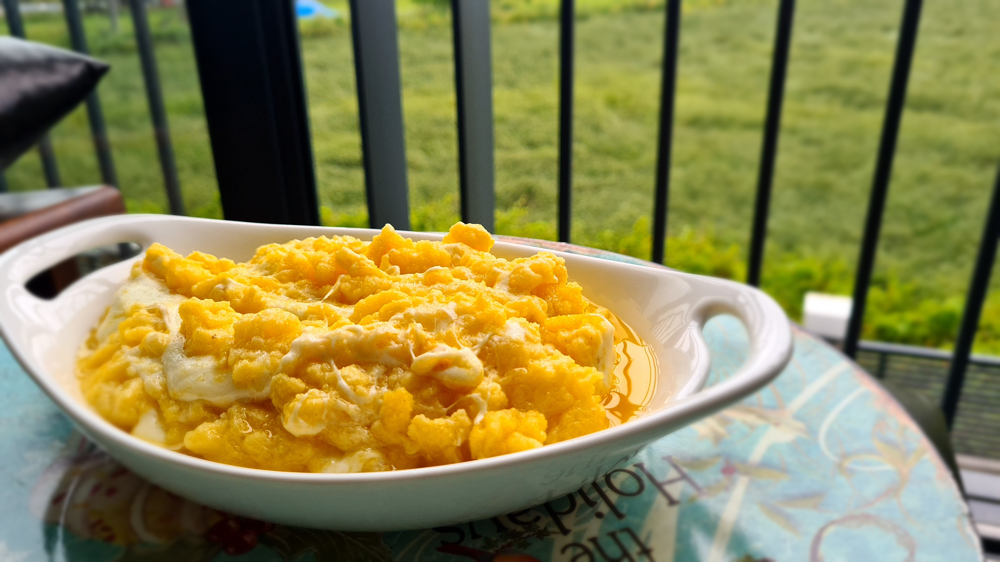

# Finding My Style in Cooking

## [Breakfast][Turkey, Black Sea Region] [Kuymak](https://en.wikipedia.org/wiki/Kuymak)

1. Bir kapta karistir: 3 yemek kasigi misir unu, uzayabilen bir peynir cesidi, 2 cay kasigi tuz, ustunu gececek kadar su 
2. Tavada 3-4 yemek kasigi tereyag erit. Bol tereyagiyla guzel olan bir tarif bu. 
3. Tereyagi iyice kizdiginda malzemeleri tavaya al. Kasikla ileri geri yapacak sekilde, seklini bozmadan karistir. Cok kati olmamasi gerekiyor, gerekiyorsa su ekle.
4. Pistigini anlamak icin peyniri gozlemliyoruz, uzamasi gerekiyor.

