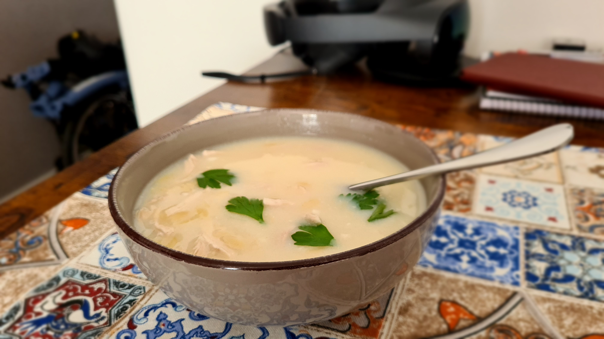

# Finding My Style in Cooking

These are the finely selected recipes that i (*will*) know by heart and repeat often, which means building my own cooking style :)
- [Soups](https://github.com/hlltarakci/my_small_world_of_curiosity/tree/main/cook_in_style#soup)
- [Salads](https://github.com/hlltarakci/my_small_world_of_curiosity/tree/main/cook_in_style#salad)
- [Meals](https://github.com/hlltarakci/my_small_world_of_curiosity/tree/main/cook_in_style#meal)
- [Breakfast](https://github.com/hlltarakci/my_small_world_of_curiosity/tree/main/cook_in_style#breakfast)

# SOUP
## [Turkish Cuisine] [Chicken Soup (with Orzo and Lemon&Egg Sauce)](https://tr.wikipedia.org/wiki/%C5%9Eehriyeli_tavuk_suyu_%C3%A7orba)

1. Bir tavuk gogsunu 10 su bardagi su ile hasla. Haslandiktan sonra suyu corbada kullanilacak. Tavugu bidikla.
2. Tencerede 1 yemek kasigi tereyagi erit.
3. 1 yemek kasigi un ekle, hizli bir sekilde kokusu cikana kadar karistir.
4. Tavuk suyunu ekle, kaynamaya birak.
5. 1 su bardagi (ya da biraz eksik) tel veya arpa sehriyeyi ekle. Karistirarak sehriyenin sismesini bekle.
6. Terbiyeyi hazirla: Yarim-bir limon suyu ile bir yumurtayi guzelce cirp.
7. Corbaya terbiyeyi eklerken, once corbadan biraz terbiyeye ekle ve karistir. Yavasca corbaya ekle, surekli karistir.
8. Parcalanmis/bidiklanmis tavuklari ekle. 10 dk. kaynasin.
9. Dolu dolur 1 tatli kasigi tuz ekle. Bir kac dk. daha kaynattiktran sonra ocagi kapat.

# SALAD

# MEAL
## [Turkey, Street Food] [Tavuklu Pilav (Chicken Pilaf)](https://goturkiye.com/10-iconic-street-foods-in-turkiye)

1. Pirinci suda beklet (en az 1 saat).
2. Tavuk gogus etini hasla (Suyu pilav yaparken kullanilacak).
3. Tencereye 2 yemek kasigi tereyag ekle. Istege gore sehriye ekle. Kavur, guzelce pembelessin.
4. Pirinci yikayip, suzdurup ekle. 2 cay kasigi tuz ekle. Kavur. Narince karistir.
5. Pirinc kavrulduktan sonra uzerini gececek kadar tavuk suyunu ekle. Pirinc sisene, suyu emene kadar pisir.
6. Ocagi kapat, kagit havlu koyarak 10-15 dk demlenmeye birak.
7. Karabiber serp, [ayran](https://en.wikipedia.org/wiki/Ayran) ile servis et.
                                       
## [Turkish Cuisine] [Et Sote (Beef Saute)](https://www.dreamstime.com/turkish-et-sote-traditional-turkish-et-sote-meat-saute-bread-vegetables-image218473270)

1. Kusbasi eti kisik ateste suyunu salip cekene kadar pisir.
2. 4-5 kucuk soga, 2-3 dis sarimsak dogra.
3. Et suyunu cektikten sonra 2 yemek kasigi siviyag ekle, karistir. Sogan ve sarimsagi ekle, kavur. Karabiber ekle.
4. 2 yemek kasigi biber salcasi ekle, kavur.
5. Ustunu gecinceye kadar sicak su ekle, pisir. Elde dagilmasi lazim.
6. 2 - 2.5 cay kasigi tuz ekle, biraz daha kaynat. Ocaktan al.
7. Patates kizartmasi, pure ya da pilavla servis edilebilir.

# BREAKFAST
## [Turkey, Black Sea Region] [Kuymak](https://en.wikipedia.org/wiki/Kuymak)

1. Bir kapta karistir: 3 yemek kasigi misir unu, uzayabilen bir peynir cesidi, 2 cay kasigi tuz, ustunu gececek kadar su 
2. Tavada 3-4 yemek kasigi tereyag erit. Bol tereyagiyla guzel olan bir tarif bu. 
3. Tereyagi iyice kizdiginda malzemeleri tavaya al. Kasikla ileri geri yapacak sekilde, seklini bozmadan karistir. Cok kati olmamasi gerekiyor, gerekiyorsa su ekle.
4. Pistigini anlamak icin peyniri gozlemliyoruz, uzamasi gerekiyor.

