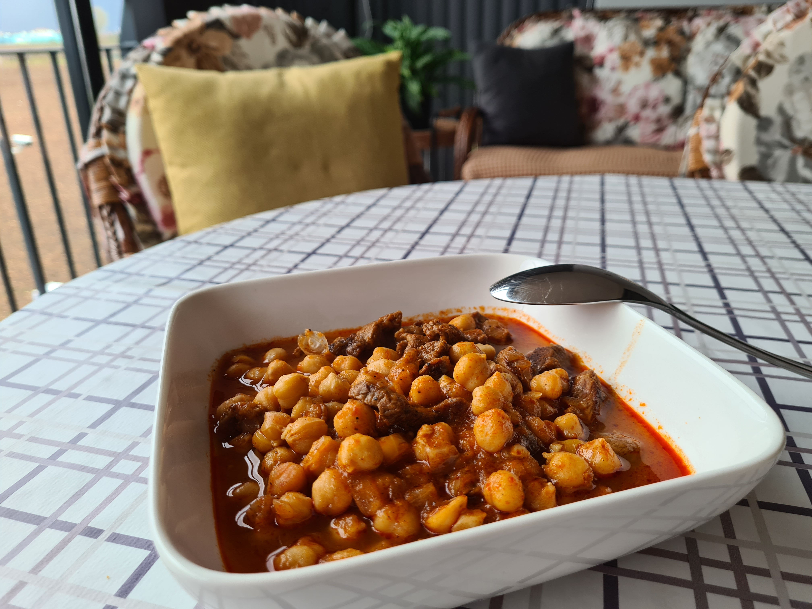
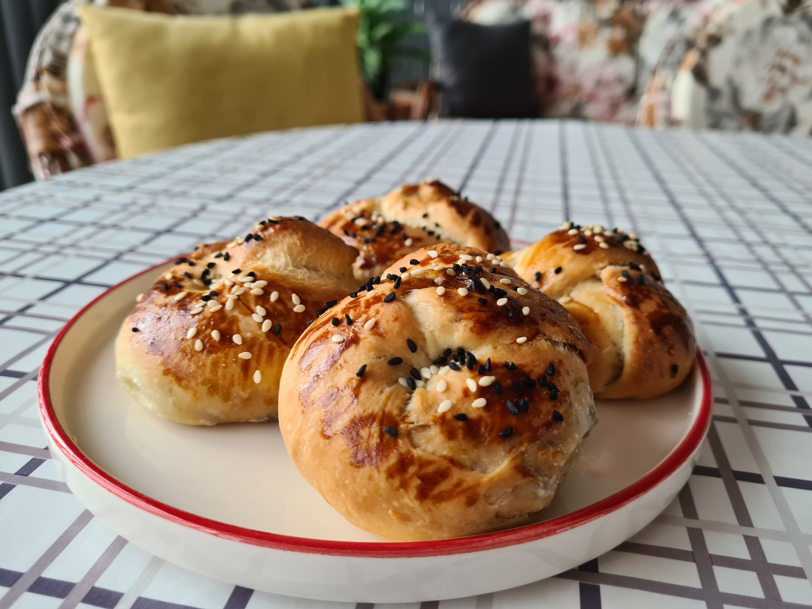
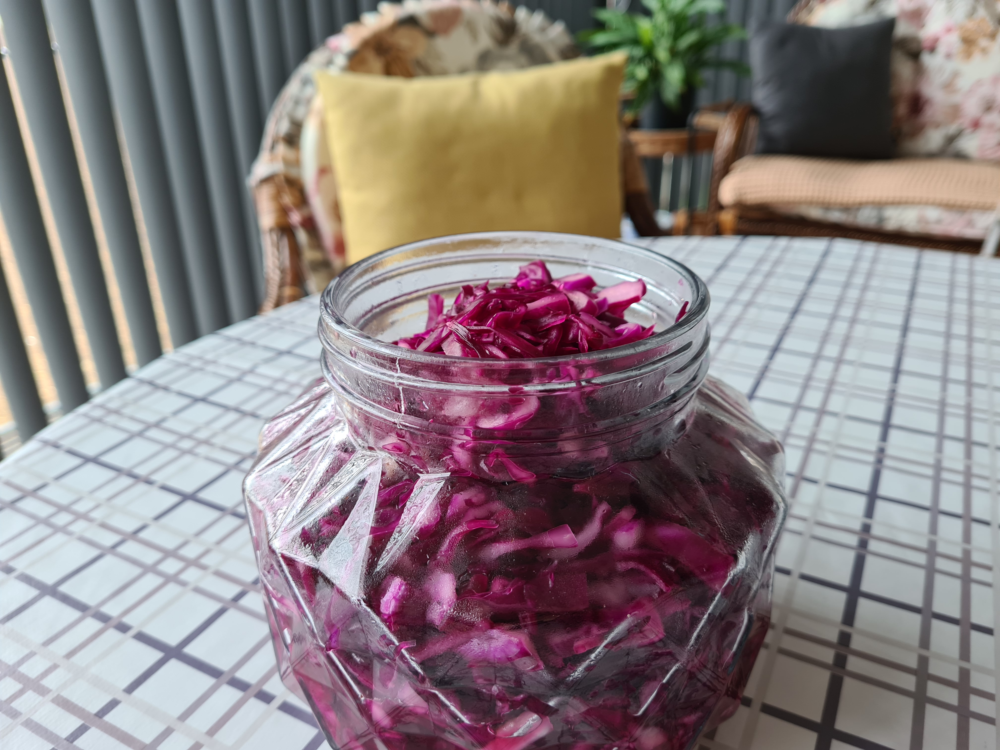
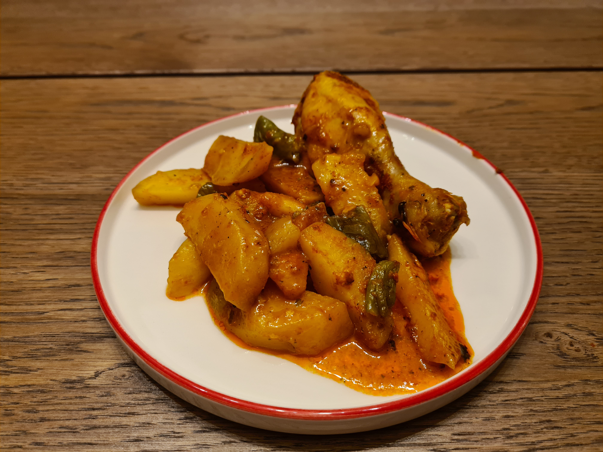
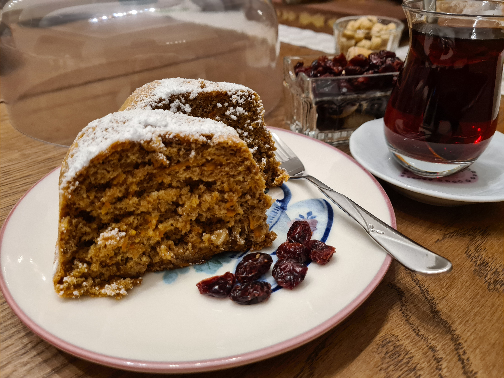
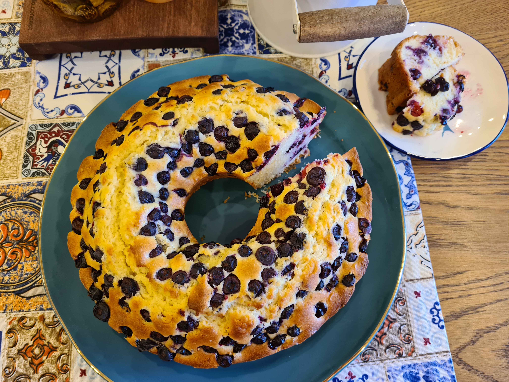

# My Cooking

## Chickpeas with Beef

1. Kusbasi eti suyunu cekene kadar kavur.
2. 2 orta boy sogani yemeklik dogra, biraz zeytingaygi ekle, kavurmaya devam et.
3. 2 yemek kasigi kadar biber salcasi ekle, karistir.
4. Ustunu gececek kadar sicak su koy, eti pisir.
5. Haslanmis nohutu ekle, 3 cay kasigi tuz, yarim cay kasigi karabiber ekle. Pisirmeye devam et.

## Kiymali Pogaca

1. Kiymali Harc: Sogani siviyagda kavur, kiyma, karabiber, tuz ekle. Sogumaya birak.
2. 10 g kuru maya (Tek pisirimlik olan 1 paket ya da 2 yemek kasigi pakmaya) + 2 tatli kasigi seker + 1 bardak sicaga yakin ilik su -> Mayanin kabarip tasmasini bekle.
3. Un + 3 cay kasigi tuz + 1 yumurta + 1 su bardagi yogurt + 1 su bardagi siviyag -> Hamur tut. Aldigi kadar un ekle, kulak memesi kivaminda olacak.
4. Hamurun kabarmasini bekle (1-2 saat alabilir)
5. Hamurdan parca kopar, kiymali harc ekle, sekil ver.
6. Ustune yumurta sarisi sur, susam, corekotu serp.
7. 180 derecede pisir.

## Purple Cabbage Salad

1. Mor lahanayi ince ince kes
2. 3 cay kasigi tuz + 2 tatli kasigi seker -> Mor lahanayi iyice ovala
3. 2,5 cay bardagi sirke ekle, iyice karistirip kavanoza koy.

## Roast Chicken

1. 2 yemek kasigi biber salcasi + biraz zeytinyagi + 1 cay kasigi tuz + bir tutam kekik, nane, kirmizi toz biber, kirmizi pul biber, karabiber -> karistir
2. Tavuk butlarini karisima bula.
3. Patates, sivri biber kizartmalik dogra, biraz zeytinyagi, 2 cay kasigi tuz ile karistir
4. Herseyi firin posetina koy, 185 derecede pisir.

## Starbucks Carrot Cake

1. 5 yumurta + 1,5 su bardagi seker -> mikserin en yuksek ayari ile cirp
2. 1 su bardagi rendelenmis havuc + 1 su bardagi iri cekilmis ceviz -> daha dusuk ayar ile cirp
3. 2 su bardagi un + 1,5 tatli kasigi tarcin -> en dusuk ayar ile cirp
4. 1 hamur kabartma tozu -> en dusuk ayar ile cirp
5. 175 derecede pisir

## Blueberry Cake

1. 3 yumurta + 1 su bardagi sut + yarim su bardagi siviyag -> cirp
2. 1 su bardagi seker + 1 paket vanilin -> cirp
3. 2,5 su bardagi un + 1 paket hamur kabartma tozu -> cirp
4. Yarim kap yaban mersini ekle -> cirp
5. Kek kalibina aldiktan sonra kalan yarim kap yaban mersinini uzerine dok
6. 175 derecede pisir.
