# Cooking
- [x] [Starbucks Carrot Cake](https://github.com/hlltarakci/inspirational_tracker/tree/main/cooking#starbucks-carrot-cake)
- [x] [Purple Cabbage Salad](https://github.com/hlltarakci/inspirational_tracker/tree/main/cooking#purple-cabbage-salad)
- [x] [Kiymali Pogaca](https://github.com/hlltarakci/inspirational_tracker/tree/main/cooking#kiymali-pogaca)
- [x] [Chickpeas with Beef](https://github.com/hlltarakci/inspirational_tracker/tree/main/cooking#chickpeas-with-beef)
- [x] [Roast Chicken](https://github.com/hlltarakci/inspirational_tracker/tree/main/cooking#roast-chicken)
- [x] [Blueberry Cake](https://github.com/hlltarakci/inspirational_tracker/tree/main/cooking#blueberry-cake)
- [x] [Salty Cake](https://github.com/hlltarakci/inspirational_tracker/tree/main/cooking#salty-cake)
- [x] [El Acmasi Kol Boregi (Pirasali)](https://github.com/hlltarakci/inspirational_tracker/tree/main/cooking#el-acmasi-kol-boregi-pirasali)
- [x] [Rolled Pastry](https://github.com/hlltarakci/inspirational_tracker/tree/main/cooking#rolled-pastry)
- [x] [False Chicken Breast Pudding](https://github.com/hlltarakci/inspirational_tracker/tree/main/cooking#false-chicken-breast-pudding)
- [x] [Cig Kofte (Turkish style vegetarian steak tartar balls)](https://github.com/hlltarakci/inspirational_tracker/tree/main/cooking#cig-kofte)
- [x] [Quince Filled Cookies](https://github.com/hlltarakci/inspirational_tracker/tree/main/cooking#quince-filled-cookies)
- [x] [Kuru Domates Salatasi](https://github.com/hlltarakci/inspirational_tracker/tree/main/cooking#kuru-domates-salatasi)
- [x] [Kiymali Pide](https://github.com/hlltarakci/inspirational_tracker/tree/main/cooking#kiymali-pide)
- [x] [Fried Anchovies (Hamsi Tava)](https://github.com/hlltarakci/inspirational_tracker/tree/main/cooking#fried-anchovies-hamsi-tava)
- [x] [Browni](https://github.com/hlltarakci/inspirational_tracker/blob/main/cooking/README.md#browni)
- [x] [Russian Tea Cakes](https://github.com/hlltarakci/inspirational_tracker/blob/main/cooking/README.md#russian-tea-cakes)
- [ ] [Strawberry Magnolia](https://www.nefisyemektarifleri.com/lezzetli-kremasiyla-cilekli-magnolia/)
- [ ] [Russian Salad](https://eatingeuropean.com/russian-salad-olivier-salad/)
- [ ] [Arnavut Boregi](https://www.nefisyemektarifleri.com/arnavut-boregi-tarifi-527442/)
- [ ] [Musakka](https://vidarbergum.com/recipe/turkish-moussaka-patlican-musakka/)
- [ ] [Yuvalama Corbasi](https://www.petitegourmets.com/recipes/turkish-yuvalama)
- [ ] [Karadeniz Pide](https://cookingorgeous.com/blog/karadeniz-pidesi/)
- [ ] [Pirasali Misir Ekmegi](https://www.nefisyemektarifleri.com/pirasali-misir-ekmegi-seveceginiz-lezzet/)
- [ ] [Mercimek Koftesi](https://www.nefisyemektarifleri.com/kolay-mercimek-koftesi/)
- [ ] [Quiche mit Käse](https://www.youtube.com/watch?v=kmSYTFjC6ao)
- [ ] [Corek](https://www.youtube.com/watch?v=_phzMtmdpUo)
- Soups
    - [x] [Tomato Soup](https://github.com/hlltarakci/inspirational_tracker/blob/main/cooking/README.md#tomato-soup)
    - [x] [Turkish Noodle Soup](https://github.com/hlltarakci/inspirational_tracker/blob/main/cooking/README.md#turkish-noodle-soup)
    - [x] [Kale Soup from Black Sea Region](https://github.com/hlltarakci/inspirational_tracker/blob/main/cooking/README.md#kale-soup-from-black-sea-region)
- Sandwich Recipes - [link1](https://www.brit.co/fancy-sandwich-recipes/) - [link2](https://insanelygoodrecipes.com/sandwich-recipes/)
- AirFryer Recipes - [link](https://twitter.com/AF_Recipes)
    - [x] [Air Fryer Crispy Cauliflower](https://github.com/hlltarakci/inspirational_tracker/blob/main/cooking/README.md#airfryer-crispy-cauliflower)
    - [x] [Air Fryer Roast Potatoes](https://github.com/hlltarakci/inspirational_tracker/blob/main/cooking/README.md#airfryer-roast-potatoes)
    - [ ] [Air Fryer Twice Baked Potatoes](https://amandascookin.com/air-fryer-twice-baked-potatoes/)
    - [ ] [Air Fryer Falafel](https://elavegan.com/air-fryer-falafel/)
    - [ ] [Air Frier Chicken Wings](https://cookinglsl.com/how-to-make-chicken-wings-in-air-fryer/)
- Breakfast Recipes - [link1](https://damndelicious.net/category/breakfast/) - [link2](https://damndelicious.net/category/breakfast/)
- AirFryer Pastry and Breakfast Stuff - [link](https://yemek.com/airfryer-tarifleri/)
    - [ ] [Peynirli Mayasiz Pogaca](https://yemek.com/tarif/airfryerda-peynirli-mayasiz-pogaca/)
    - [ ] [Patatesli Kasarli Kalem Borek](https://yemek.com/tarif/airfryerda-patatesli-kasarli-kalem-borek/)
    - [ ] [Milfoy Simit](https://yemek.com/tarif/airfryerda-milfoy-simit/)
    - [ ] [Chocolate Croissant](https://yemek.com/tarif/airfryerda-milfoyden-cikolatali-kruvasan/)
    - [ ] [Apple-Carrot Cake](https://yemek.com/tarif/airfryerda-elmali-havuclu-kek/)
    - [ ] [Chestnut](https://yemek.com/tarif/airfryerda-kestane-kebap/)
    - [ ] [Chickpea Chips](https://www.nefisyemektarifleri.com/airfryerde-citir-nohut-videolu/)
    - [ ] [Potato Croquettes](https://yemek.com/tarif/airfryerda-patates-kroket/)
    - [ ] [Grilled Cheese Sandwich](https://www.youtube.com/watch?v=pfpR4lMyVi0)
    - [ ] [Potato Wedges](https://www.youtube.com/watch?v=DKfha8VL3ho)
    - [ ] [Garlic Bread](https://www.youtube.com/watch?v=4z-sZKDsX7M)
    - [ ] [Glace Cherry Cake](https://github.com/hlltarakci/inspirational_tracker/blob/main/cooking/README.md#glace-cherry-cake)
- Cold Appetizers - [link1](https://yemek.com/soguk-meze-tarifleri/) - [link2](https://www.nefisyemektarifleri.com/liste/yilbasi-soguk-mezeler/) - [link3](https://insanelygoodrecipes.com/cold-appetizers/) 
- Puff Pastry Recipes - [link1](https://www.youtube.com/watch?v=AURckArzbrY) - [link2](https://www.tasteofhome.com/collection/must-try-puff-pastry-recipes/) - [link3](https://www.bbcgoodfood.com/recipes/collection/puff-pastry-recipes) - [link4](https://www.bonappetit.com/recipes/slideshow/puff-pastry-recipe-ideas)

## Chickpeas with Beef

1. Kusbasi eti suyunu cekene kadar kavur.
2. 2 orta boy sogani yemeklik dogra, biraz zeytingaygi ekle, kavurmaya devam et.
3. 2 yemek kasigi kadar biber salcasi ekle, karistir.
4. Ustunu gececek kadar sicak su koy, eti pisir.
5. Haslanmis nohutu ekle, 3 cay kasigi tuz, yarim cay kasigi karabiber ekle. Pisirmeye devam et.

## Kiymali Pogaca

1. Kiymali Harc: Sogani siviyagda kavur, kiyma, karabiber, tuz ekle. Sogumaya birak.
2. 10 g kuru maya (Tek pisirimlik olan 1 paket ya da 2 yemek kasigi pakmaya) + 2 tatli kasigi seker + 1 bardak sicaga yakin ilik su -> Mayanin kabarip tasmasini bekle.
3. Un + 3 cay kasigi tuz + 1 yumurta + 1 su bardagi yogurt + 1 su bardagi siviyag -> Hamur tut. Aldigi kadar un ekle, kulak memesi kivaminda olacak.
4. Hamurun kabarmasini bekle (1-2 saat alabilir)
5. Hamurdan parca kopar, kiymali harc ekle, sekil ver.
6. Ustune yumurta sarisi sur, susam, corekotu serp.
7. 180 derecede pisir.

## Purple Cabbage Salad

1. Mor lahanayi ince ince kes
2. 3 cay kasigi tuz + 2 tatli kasigi seker -> Mor lahanayi iyice ovala
3. 2,5 cay bardagi sirke ekle, iyice karistirip kavanoza koy.

## Roast Chicken

1. 2 yemek kasigi biber salcasi + biraz zeytinyagi + 1 cay kasigi tuz + bir tutam kekik, nane, kirmizi toz biber, kirmizi pul biber, karabiber -> karistir
2. Tavuk butlarini karisima bula.
3. Patates, sivri biber kizartmalik dogra, biraz zeytinyagi, 2 cay kasigi tuz ile karistir
4. Herseyi firin posetina koy, 185 derecede pisir.

## Starbucks Carrot Cake

1. 5 yumurta + 1,5 su bardagi seker -> mikserin en yuksek ayari ile cirp
2. 1 su bardagi rendelenmis havuc + 1 su bardagi iri cekilmis ceviz -> daha dusuk ayar ile cirp
3. 2 su bardagi un + 1,5 tatli kasigi tarcin -> en dusuk ayar ile cirp
4. 1 hamur kabartma tozu -> en dusuk ayar ile cirp
5. 175 derecede pisir

## Blueberry Cake

1. 3 yumurta + 1 su bardagi sut + yarim su bardagi siviyag -> cirp
2. 1 su bardagi seker + 1 paket vanilin -> cirp
3. 2,5 su bardagi un + 1 paket hamur kabartma tozu -> cirp
4. Yarim kap yaban mersini ekle -> cirp
5. Kek kalibina aldiktan sonra kalan yarim kap yaban mersinini uzerine dok
6. 175 derecede pisir.

## Salty Cake
[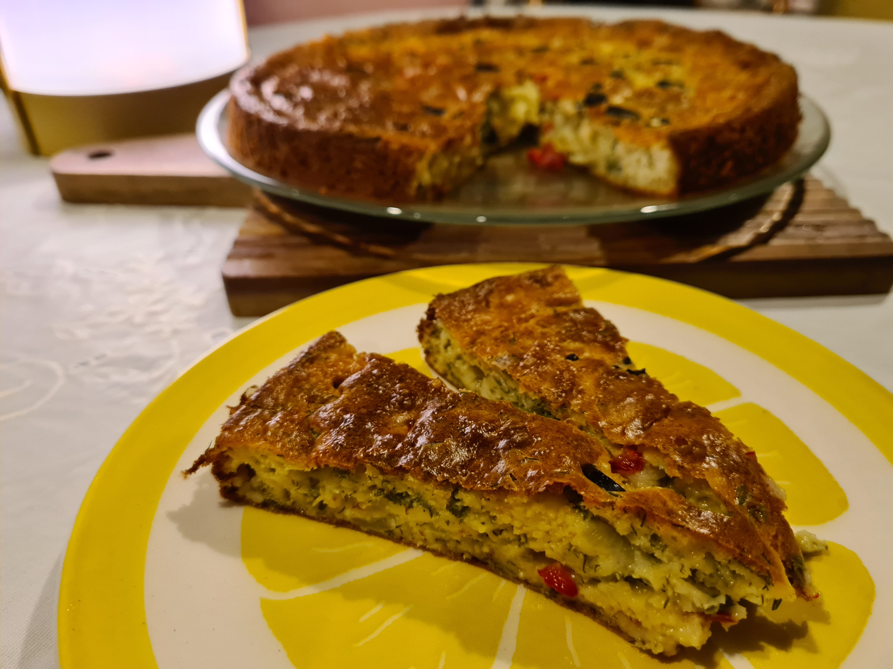](salty_cake.jpg)
1. 3 yumurta + 1 yemek kasigi seker + 1 su bardagi yogurt + yarim su bardagi siviyag -> cirp
2. 2 su bardagi un + 1 paket kabartma tozu + 1 silme tatli kasigi tuz -> cirp
3. Ince kiyilmis bir tutam maydanoz, dereotu + kucuk dogranmis kirmizi biber + 1 su bardagi ufalanmis beyaz peynir + yarim su bardagi dogranmis siyah zeytin + ince dogranmis yarim sogan -> cirp
4. 170 derecede pisir.

## El Acmasi Kol Boregi (Pirasali)

1. Ic harci: Pirasayi dogra, tencereye al. Tuz at, kavur. Cok az siviyag, sut kaymagi koy. Pisir.
2. KitchenAid e un + su + 1 kasik zeytinyagi + tuz -> yogur. Yumusak bir hamur olsun.
3. Hamuru parcalara bol, ustune sofra bezini kapat. En az 1 saat beklesin.
4. Hamuru actir, ince olmali. Kenarlarini kes. Harctan koyup rulo yap, tepsiye yerlestir.
5. 180 derecede pisir.

## Rolled Pastry
[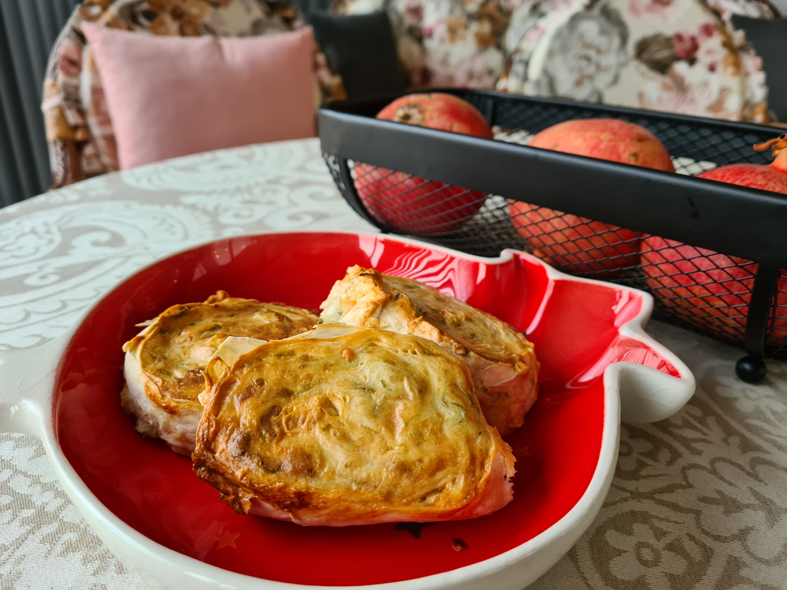](rolled_pastry.jpg)
1. 4 haslanmis patates + 1 yemek kasigi tereyag + yarim demet ince kiyilmis maydanoz -> iyice ez, karistir
2. 1 yumurta + 1 su bardagi sut + 1 su bardagi rendelenmis kasar + biraz tuz -> karistir
3. Yufkayi ser, arasina harctan koy, 5 adet yufkayi boyle sirala. Rulo yap, 3e bol. Bir gece buzlukta beklet.
4. 2 yemek kasigi yogurt + 1 yumurta -> karistir.
5. Rulolari 1 santim kalinliginda kes, uzerine karisimdan sur.
6. 180 derecede pisir.

## False Chicken Breast Pudding
[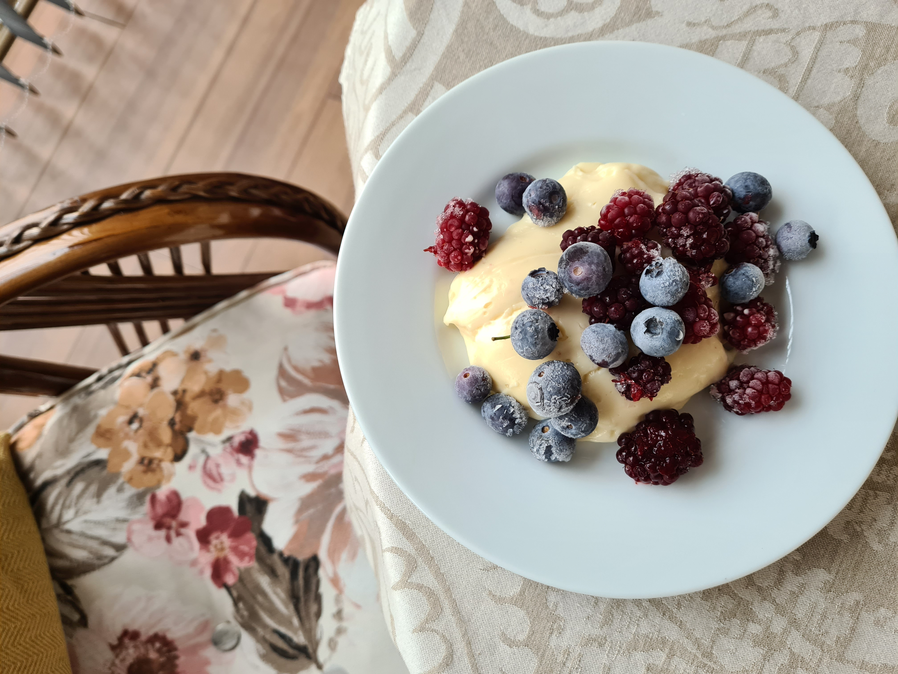](false_chicken_breast_pudding.jpg)
1. 125 gram kadar tereyagi tencerede erit.
2. 1 su bardagi un ekle, 2-3 dk kavur
3. 1,5 su bardagi seker, 1-2 dk kavur
4. 1 kilo soguk sut ekle, karistir. Kaynamaya baslayinca 10 dk kaynat.
5. Biraz soguyunca 1 paket vanilya ilave et. En az 5 dk. mikserle cirp, sut ilave edip kivami ayarla.

## Cig Kofte
[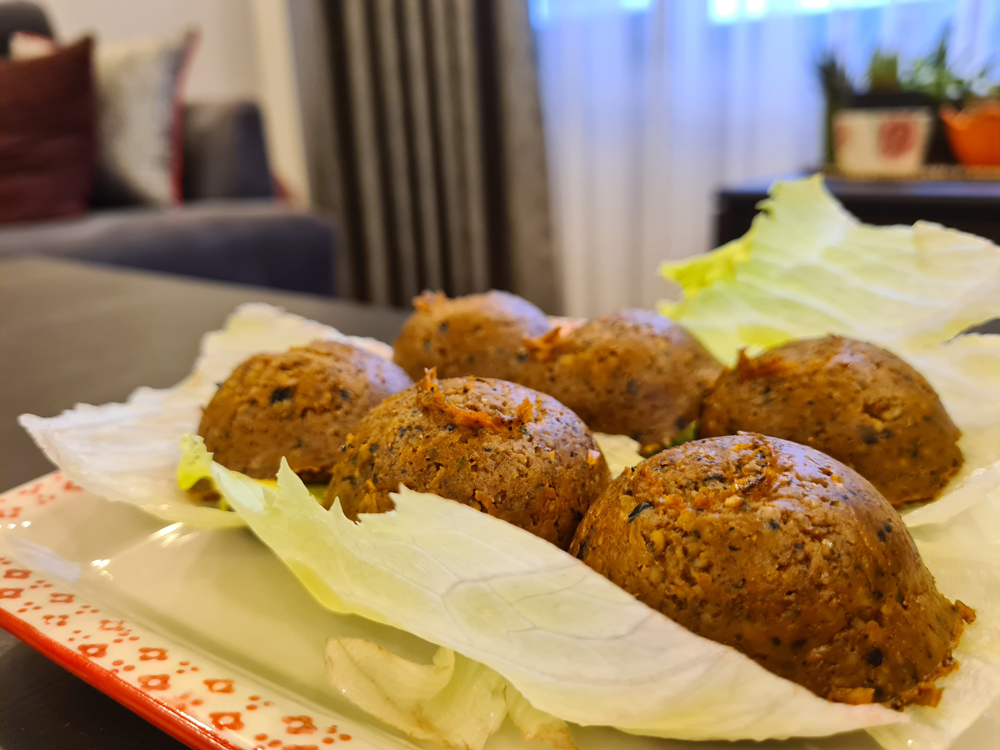](cigkofte.jpg)
1. 5 su bardagi sicak su + 5 su bardagi cig koftelik esmer bulgur -> KitchenAid in kabinda, ustunu kapatip 20 dk dinlendir.
2. Malzemeleri derin bir kapta karistir:
  - 3 yemek kasigi domates salcasi
  - 3 yemek kasigi biber salcasi
  - 1,5 su bardagi zeytinyagi
  - 1 cay bardagi isot
  - 1 su bardagi nar eksisi
  - 2 tatli kasigi nane
  - Yarim tatli kasigi kimyon
  - 1 tatli kasigi kirkizi toz biber
  - 1 tatli kasigi karabiber
  - Yarim cay kasigi muskat rendesi (opsiyonel)
  - Rendelenmis 2 sogan
  - 1 bas sarimsak, rendelenmis
3. KitchenAid de 20-30 dk karistir.
4. Servis etmeye yakin sekil ver.

## Quince Filled Cookies
[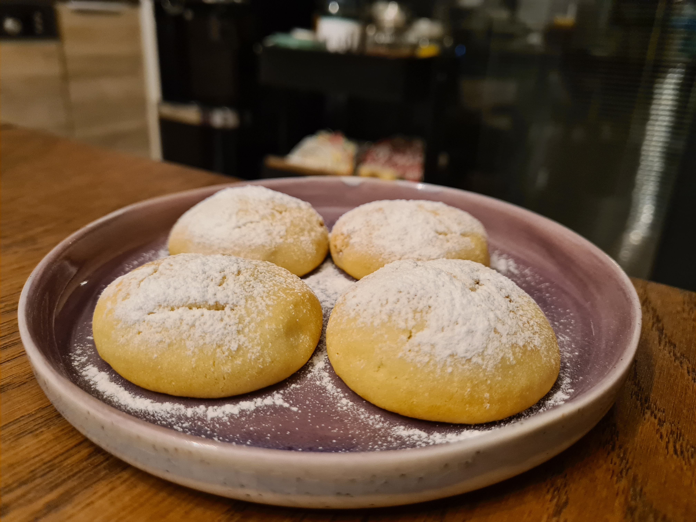](quince_filled_cookies.jpg)
1. Ici: 1  ayva rendele, 1 cay bardagi toz seker ekle. Suyunu salip cekinceye kadar pisir. Yarim cay bardagi cekilmis ceviz, 1 cay kasigi tarcin ekle, karistir. Sogumaya birak.
2. 200 gram oda sicakliginda tereyag, 1 cay bardagi pudra sekeri, 1 yemek kasigi yogurt -> yogurmaya basla.
3. 2-2.5 su bardagi unu azar azar ekle. 1 paket vanilin, 1 paket hamur kabartma tozunu unla karistirip ekle. Ele yapismayan hamur olsun. Ustunu nemli bezle kapatip, 20 dk beklet.
4. Sekil ver, icini koy.
5. 175 derecede 20-25 dk pisir.

## Kuru Domates Salatasi
[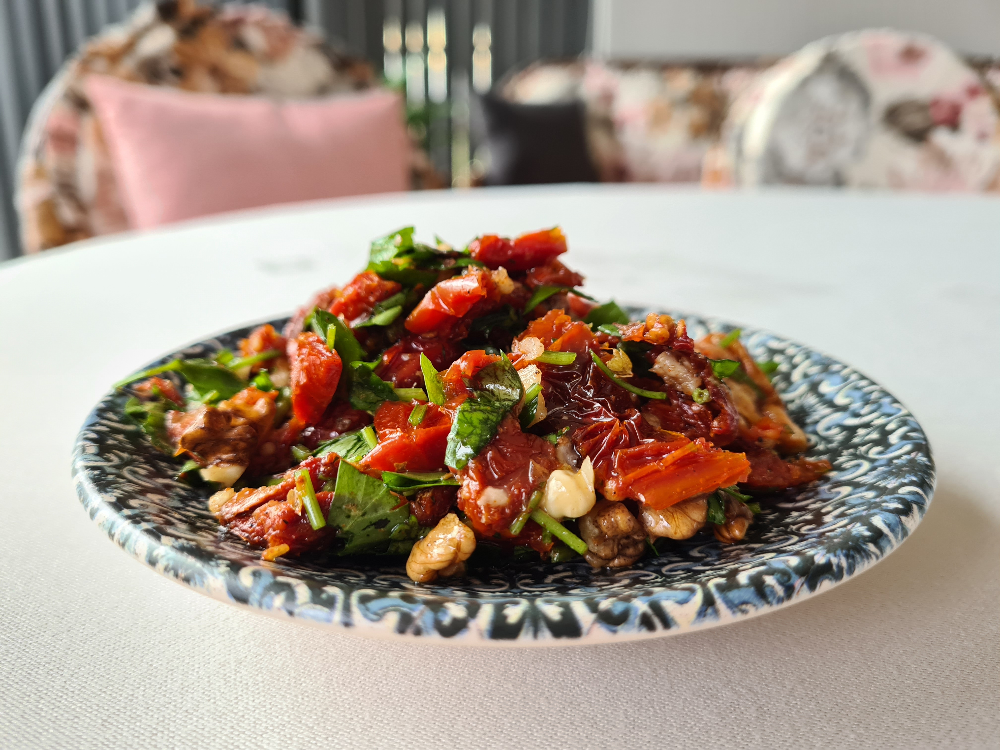](kuru_domates_salatasi.jpg)
1. 15-20 kuru domatesi 20 dk kadar sicak su icinde beklet. Daha sonra kagit havlu ile kurula.
2. Kuru domates + 4 dis sarimsak + Yarim su bardagi ceviz + bir tutam maydanoz -> dogra, salataya karistir.
3. 1 cay bardagi zeytinyagi + 1 tatli kasigi kekik + 1 tatli kasigi toz biber + yarim cay kasigi karabiber + tuz -> salataya ekle, karistir.

## Kiymali Pide
[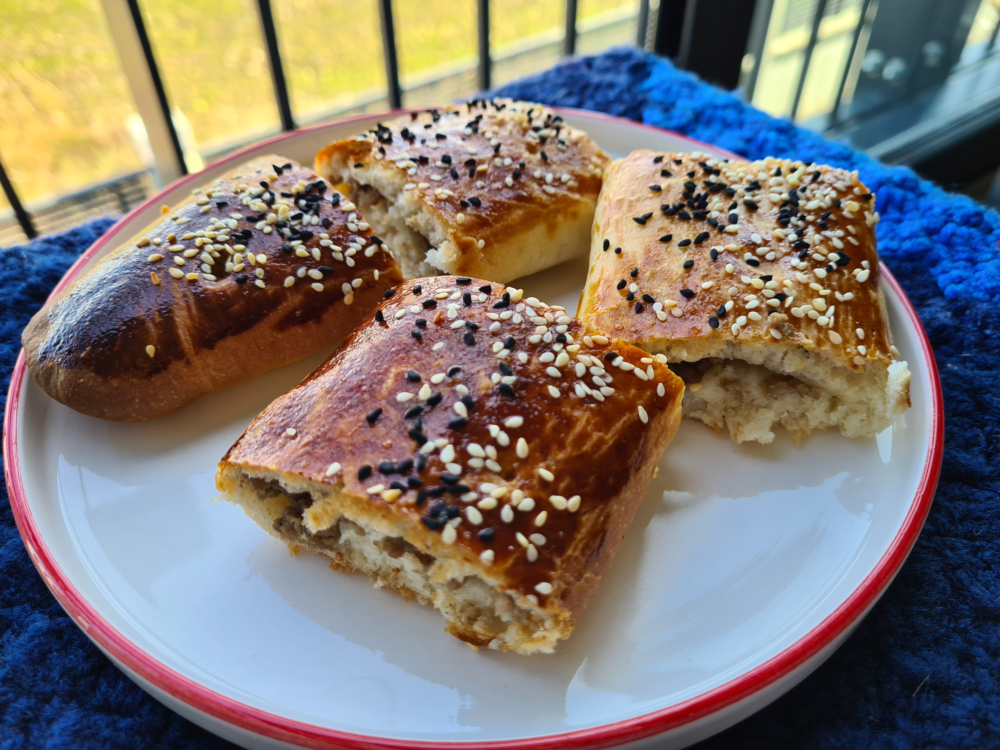](kiymali_pide.jpg)
1. Kiymali Harc: Sogani siviyagda kavur, kiyma, karabiber, tuz ekle. Sogumaya birak.
2. 10 g kuru maya (Tek pisirimlik olan 1 paket ya da 2 yemek kasigi pakmaya) + 6-7 tatli kasigi seker + 1 bardak sicaga yakin ilik su -> Mayanin kabarip tasmasini bekle.
3. Un + 3 cay kasigi tuz + 1 su bardagi sut + 1 su bardagi siviyag -> Hamur tut. Aldigi kadar un ekle, kulak memesi kivaminda olacak.
4. Hamurun kabarmasini bekle (1-2 saat alabilir)
5. Hamurdan parca kopar, kiymali harc ekle, sekil ver.
6. Ustune yumurta sarisi sur, susam, corekotu serp.
7. 180 derecede pisir.

## Fried Anchovies (Hamsi Tava)
[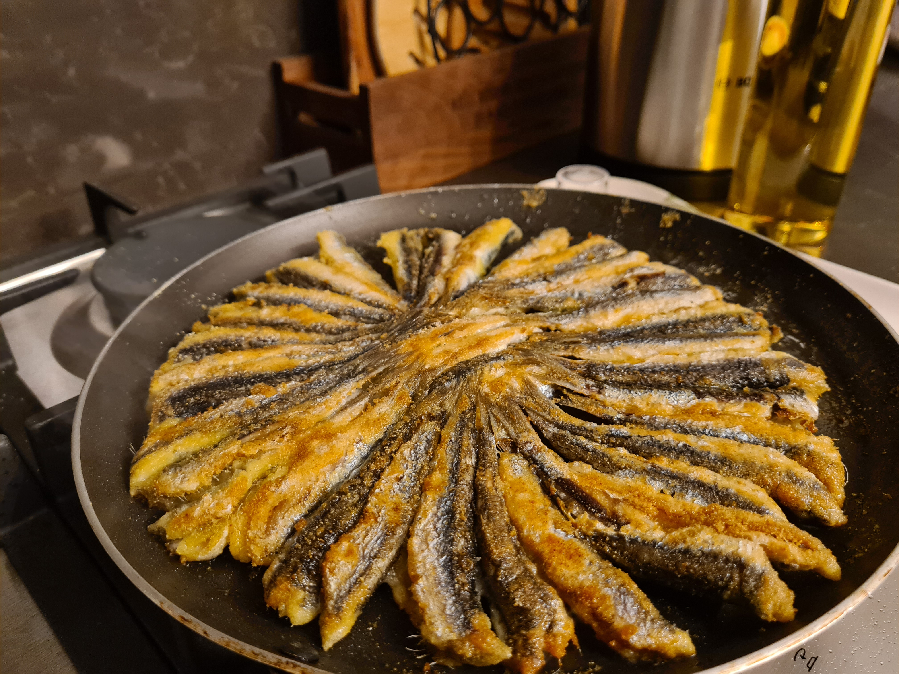](fried_anchovies.jpg)
1. Hamsileri temizle, yika, suzdur. 10 dk beklesin.
2. Tuz ve misir unu ile hamsileri karistir.
3. Cok az kizartmalik yag ile tavada kizart.

## Tomato Soup
[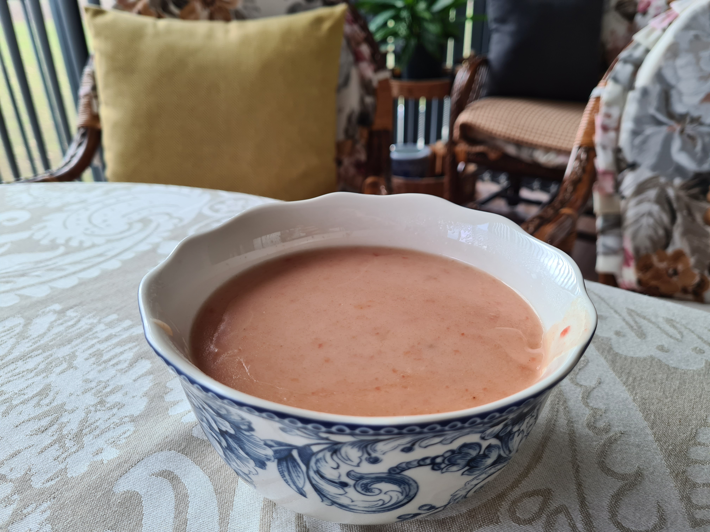](tomato_soup.jpg)
1. 2 yemek kasigi tereyag -> tencerede erit.
2. 3 yemek kasi dolu dolu un -> kokusu cikana kadar kavur.
3. 1 su bardagi sut + 1 su bardagi domates suyu -> ekle, karistir.
4. Sicak su veya tavuk/et suyu ekle -> kaynat.
5. 3 cay kasigi tuz + 1 tutan karabiber ekle.
6. 5 dk kadar kaynat.

## Browni
[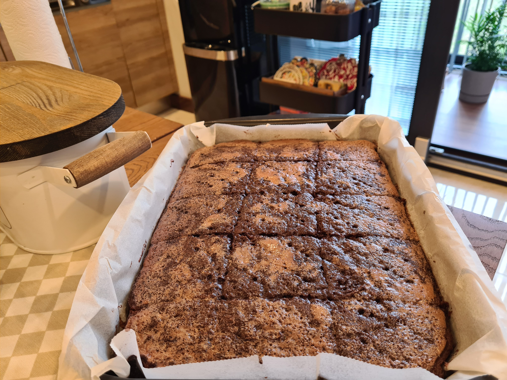](browni.jpg)
1. 4 yumurta + 2 su bardagi seker -> 5 dk cirp
2. 2 su bardagi sut + 1 su bardagi siviyag -> ekle, cirp
3. 50 gr kakao (1 paket ya da 3 yemek kasigi) + 1 paket vanilin -> cirp. 1,5 su bardagi kadar kenarda ayir
4. 2 su bardagi un + 1 paket hamur kabartma tozu -> cirp. Kaliba dok.
5. 170 derecede pisir. Catal ile delerek ayrilmis islak karisimi dok.

## AirFryer Crispy Cauliflower
[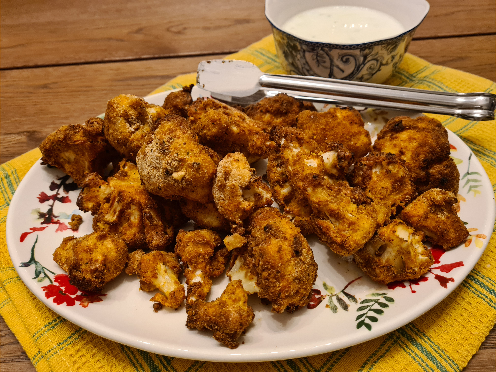](airfryer_crispy_cauliflower.jpg)
1. Karnibahari yika, buyuk parcalar halinde kes
2. Bir kaseye un + tuz koy, bir kaseye 2-3 yumurta cirp, bir kaseye galeta unu + tuz + baharatlar (kirmizi toz biber, karabiber, kirmizi pul biber, kekik vs) koy
3. Karnibaharlari sirayla una, yumurtaya ve galeta unu karisimina bula. Uzerlerine siviyag spreyle.
4. AirFryer da 200 derecede arada karistirarak 20 dk kadar pisir. Cacik veya sarimsakli yogurtla servis yap.

## Russian Tea Cakes
[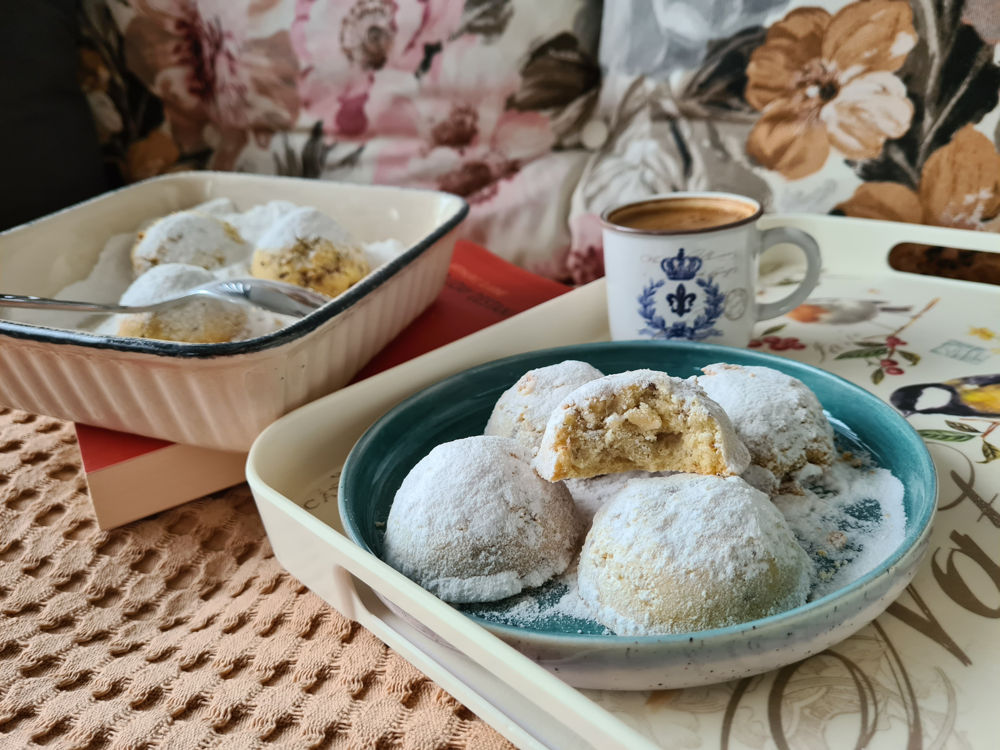](russian_tea_cakes.jpg)
1. 200 gr oda sicakliginda tereyag + 1 paket vanilya -> 2-3 dk mikserle cirp
2. 2 su bardagi un + yarim su bardagi pudra sekeri -> Bir kasede karistir. Sonra ekle ve mikserle biraz cirp
3. 1 su bardagi kesilmis ceviz -> Ekle ve biraz cirp.p
4. Sekil ver. Dondurma kasiginda presleyerek sekil verilebiliyor.
5. 175 derecede 15 dk pisir. Izgara uzerine al, 10-15 dk soguduktan sonra pudra sekerinde yuvarla

## Turkish Noodle Soup
[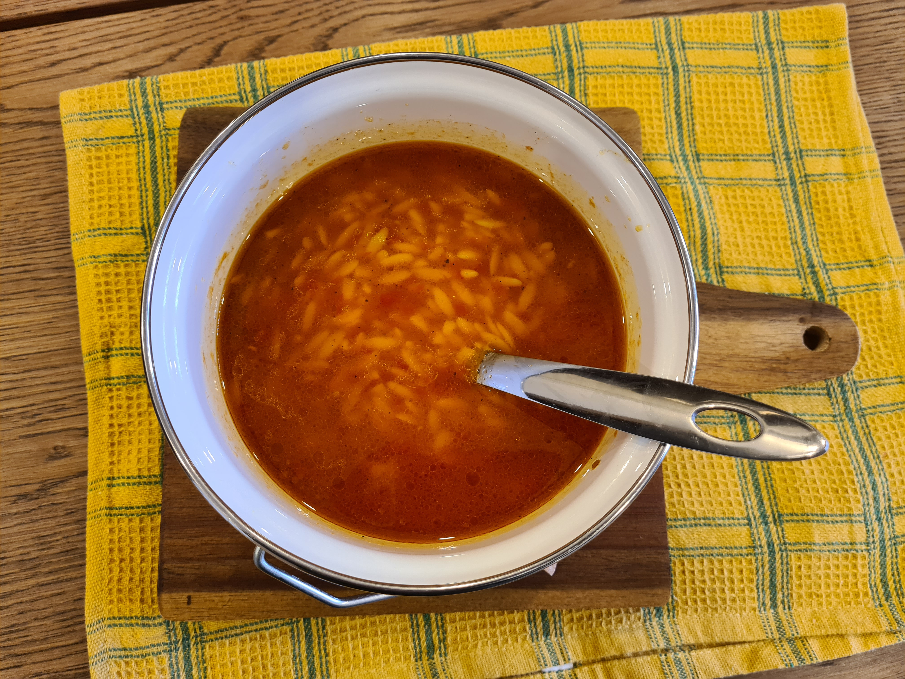](turkish_noodle_soup.jpg)
1. 5 yemek kasigi zeytinyagi + 5-6 yemek kasigi domates rendesi + (opsiyonel)1 tatli kasigi salca -> Tencereye koy, isit
2. 5-6 su bardagi sicak su -> tencereye ekle, kaynat
3. 1 cay bardagindan biraz fazla arpa sehriye -> ekle, karistir
4. 3 cay kasigi tuz + 1 cay kasigi karabiber -> ekle
5. (Opsiyonel) 1 tavuk ya da et bulyon ekle
6. Arpa sehriyeler pisince dinlenmeye birak

## Kale Soup from Black Sea Region
[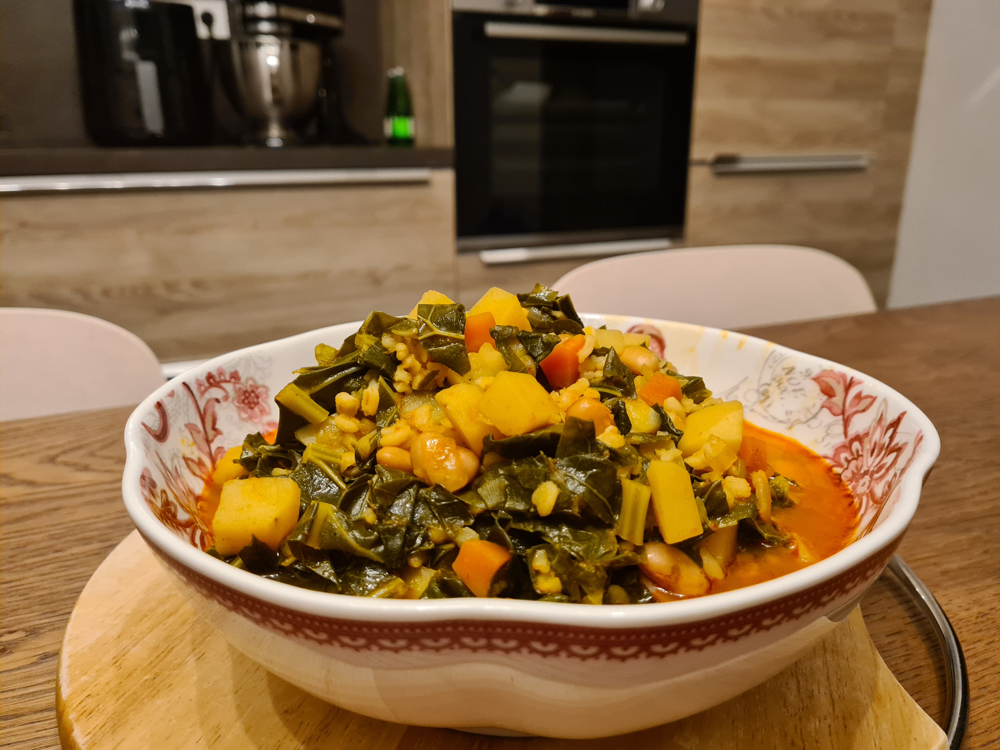](kale_soup_from_blacksea_region.jpg)
1. 2 demet kadar kara lahanayi yika, dogra.
2. 2 orta boy sogan -> yemeklik dogra
3. Soganlari 4-5 yemek kasigi zeytonyagi ile kavur
4. 2-3 dis sarimsak -> dogra ve tencereye ekle
5. 2 yemek kasigi biber salcasi -> tencereye ekle
6. 3 orta boy patates -> kup kup dogra
7. 3 kucuk havuc -> kucuk kucuk dogra
8. Sogan-sarimsak kavrulunca, patates, havuc ve 1 cay bardagi barbunya tencereye ekle, kavur
9. Karalahanayi ekle, biraz kavrulsun
10. 2-3 yemek kasigi bulgur, 3 cay kasigi tuz + 1 cay kasigi pul biber + yarim cay kasigi karabiber ekle, ustune gececek kadar su ilave et. Yarim saat kadar pisir

## AirFryer Roast Potatoes
[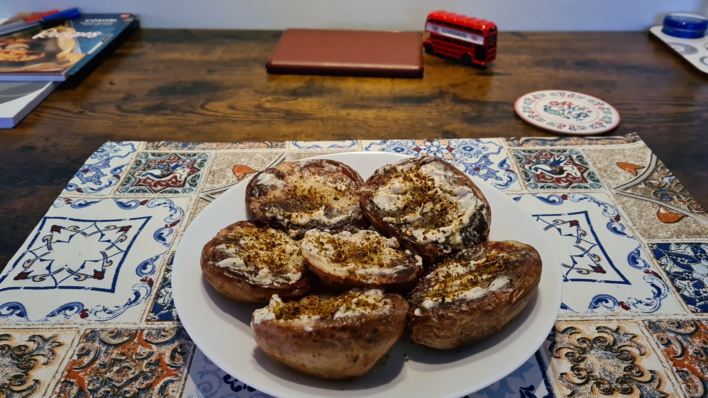](roast_potatoes.jpeg)
1. Patatesleri ortadan kes, tuzla, AirFryer da pisir.
2. Ustune tereyag, peynir, poy (karisik baharat) ekle.

## Glace Cherry Cake
[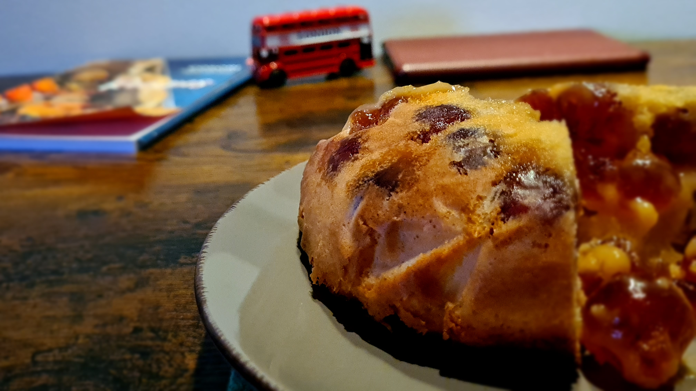](glace_cherry_cake.jpg)
1. 2 yumurta, cirp
2. 1/2 bardak seker, iki seferde ekle, cirp
3. 5 yemek kasigi yag (ceviz yagi) ekle, cirp
4. 1 su bardagi un, 1/2 cay kasigi baking powder, 1/4 cay kasigi tuz ekle, iki severde karisima ekle, cirp
5. 1/4 su bardagi sut ekle, cirp
6. Bir kap glace cherry ekle
7. AirFryerda 175 derecede pisir
