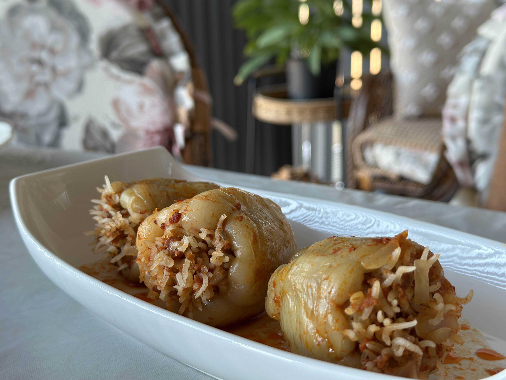
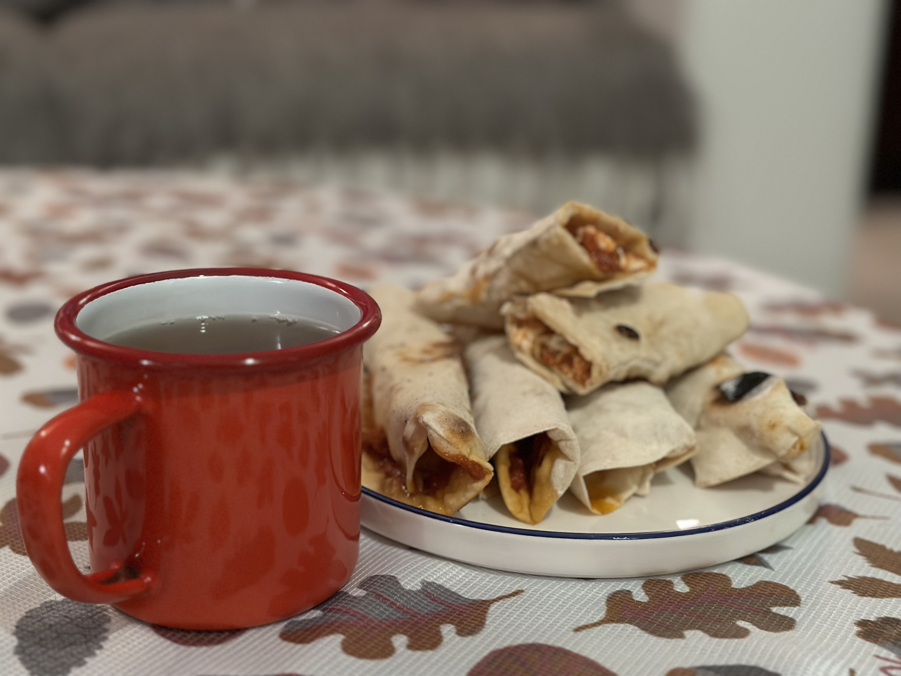
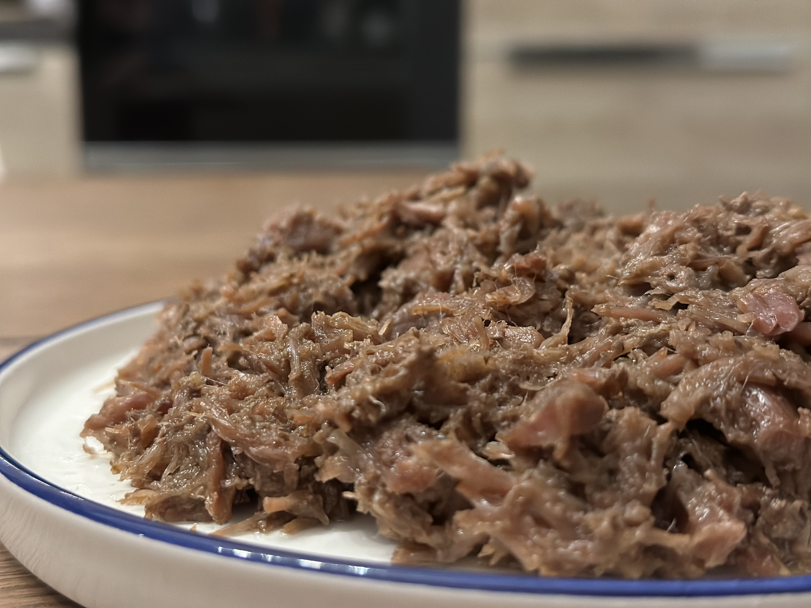
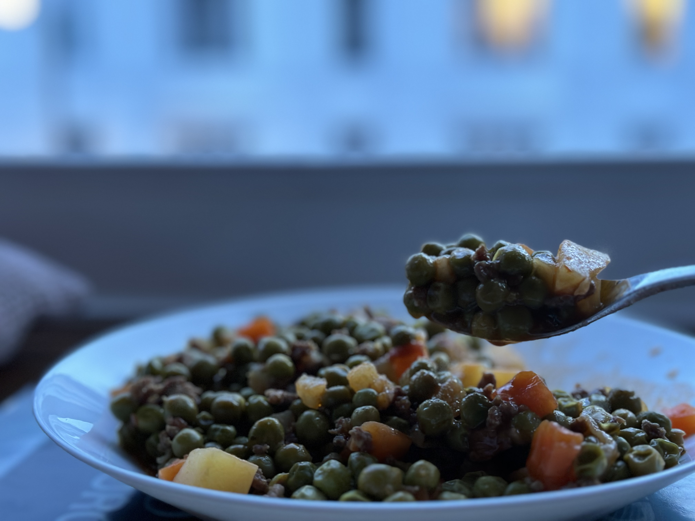
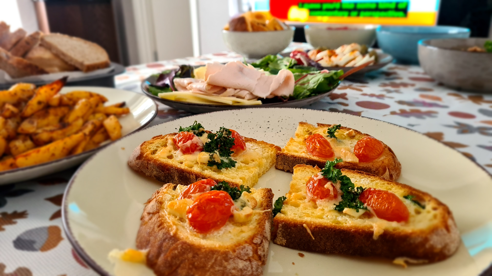

# Cooking

# SOUPS

## Kale Soup from Black Sea Region

1. 2 demet kadar kara lahanayi yika, dogra.
2. 2 orta boy sogan -> yemeklik dogra
3. Soganlari 4-5 yemek kasigi zeytonyagi ile kavur
4. 2-3 dis sarimsak -> dogra ve tencereye ekle
5. 2 yemek kasigi biber salcasi -> tencereye ekle
6. 3 orta boy patates -> kup kup dogra
7. 3 kucuk havuc -> kucuk kucuk dogra
8. Sogan-sarimsak kavrulunca, patates, havuc ve 1 cay bardagi barbunya tencereye ekle, kavur
9. Karalahanayi ekle, biraz kavrulsun
10. 2-3 yemek kasigi bulgur, 3 cay kasigi tuz + 1 cay kasigi pul biber + yarim cay kasigi karabiber ekle, ustune gececek kadar su ilave et. Yarim saat kadar pisir

## [Chicken Soup (with Orzo and Lemon&Egg Sauce)](https://tr.wikipedia.org/wiki/%C5%9Eehriyeli_tavuk_suyu_%C3%A7orba)

1. Bir tavuk gogsunu 10 su bardagi su ile hasla. Haslandiktan sonra suyu corbada kullanilacak. Tavugu bidikla.
2. Tencerede 1 yemek kasigi tereyagi erit.
3. 1 yemek kasigi un ekle, hizli bir sekilde kokusu cikana kadar karistir.
4. Tavuk suyunu ekle, kaynamaya birak.
5. 1 su bardagi (ya da biraz eksik) tel veya arpa sehriyeyi ekle. Karistirarak sehriyenin sismesini bekle.
6. Terbiyeyi hazirla: Yarim-bir limon suyu ile bir yumurtayi guzelce cirp.
7. Corbaya terbiyeyi eklerken, once corbadan biraz terbiyeye ekle ve karistir. Yavasca corbaya ekle, surekli karistir.
8. Parcalanmis/bidiklanmis tavuklari ekle. 10 dk. kaynasin.
9. Dolu dolur 1 tatli kasigi tuz ekle. Bir kac dk. daha kaynattiktran sonra ocagi kapat.

## Tomato Soup

1. 2 yemek kasigi tereyag -> tencerede erit.
2. 3 yemek kasi dolu dolu un -> kokusu cikana kadar kavur.
3. 1 su bardagi sut + 1 su bardagi domates suyu -> ekle, karistir.
4. Sicak su veya tavuk/et suyu ekle -> kaynat.
5. 3 cay kasigi tuz + 1 tutan karabiber ekle.
6. 5 dk kadar kaynat.

## Yogurt Soup with Orzo

1. Tencereye 1 yumurta kir, guzelce cirp.
2. 1 su bardagi yogurt ekle, cirp.
3. 2 yemek kasigi un ekle, cirp.
4. Yavas yavas, karistirarak 7 su bardagi su ekle, cirp.
5. Ocakta orta ateste karistirarak kaynat.
6. Yarim su bardagi arpa sehriye ekle, 15 dakika kadar daha karistirarak kaynat.
7. 1 tatli kasigi tuz ekle (**TIP: Yogurt corbalarina tuz en son eklenir.**)
8. Tencereyi ocaktan al, 15 dk kadar demlenmeye birak.
9. Tavada 1 yemek kasigi tereyagi kizdir, 1 tatli kasigi nane ekle. Corbayi servis ederken ya da tencereye ekle.   

## Turkish Noodle Soup

1. 5 yemek kasigi zeytinyagi + 5-6 yemek kasigi domates rendesi + (opsiyonel)1 tatli kasigi salca -> Tencereye koy, isit
2. 5-6 su bardagi sicak su -> tencereye ekle, kaynat
3. 1 cay bardagindan biraz fazla arpa sehriye -> ekle, karistir
4. 3 cay kasigi tuz + 1 cay kasigi karabiber -> ekle
5. (Opsiyonel) 1 tavuk ya da et bulyon ekle
6. Arpa sehriyeler pisince dinlenmeye birak

## Kiyma Paca (Soup with Minced Beef)

1. 100 gram kadar kiymayi rengi degisene kadar tencerede kavur. Kavururken azar azar sicak su ekleyerek kavur.
2. Bir cay kasigi karabiber ekle. Azar azar sicak su ekleyerek biraz daha kavur.
3. Iki yemek kasigi zeytinyagi (ya da ceviz yagi) ekle. Biraz daha kavur. 4 su bardagi sicak su ekle, kaynasin.
4. Terbiyesi icin: 2 yemek kasigi dolu dolu un + 4 yemek kasigi yogurt + 1 yumurta + yarim su bardaginsicak su + 1 yemek kasigi limon suyu ekle. Guzelce cirp.
5. Kesilmemesi icin tencereden bir kepce corba terbiyeye ekle ve karistir. Corbayi karistirarak terbiyeyi ekle. Kivami cok yogun ise, sicak su ekle. (Toplamda 6 su bardagi ekledim)
6. Kaynamaya baslayinca 1 tatli kasigi tuz ve yarim cay kasigi karabiber ekle. (Sarimsak da eklenebilir). 10 dk kaynamaya birak.
7. Uzeri icin 1 tatli kasigi kirmizi biberi bir yemek kasigi tereyagda yak. 

## Fake Dumplings

1. 200 gr kadar kiyma + rendelenmis 1 orta boy sogan + 1 tatli kasigi karabiber + 1 tatli kasigi tuz -> Guzelce yogur. 30 dk buzdolabinda beklet.
2. Tencerede makarna suyunu kaynatirken, manti makarnalarin icine kiymali harctan koy.
3. Makarna gibi pisir.
4. Servis yaparken uzerine cirpilmis yogurt ekle. Sarimsakli yogurt cok guzel oluyor.
5. Tavada siviyagda nane, kirmizi biber yak. Uzerine dok.

# OVEN RECIPES
## El Acmasi Kol Boregi (Pirasali)

1. Ic harci: Pirasayi dogra, tencereye al. Tuz at, kavur. Cok az siviyag, sut kaymagi koy. Pisir.
2. KitchenAid e un + su + 1 kasik zeytinyagi + tuz -> yogur. Yumusak bir hamur olsun.
3. Hamuru parcalara bol, ustune sofra bezini kapat. En az 1 saat beklesin.
4. Hamuru actir, ince olmali. Kenarlarini kes. Harctan koyup rulo yap, tepsiye yerlestir.
5. 180 derecede pisir.

## Kiymali Pogaca

1. Kiymali Harc: Sogani siviyagda kavur, kiyma, karabiber, tuz ekle. Sogumaya birak.
2. 10 g kuru maya (Tek pisirimlik olan 1 paket ya da 2 yemek kasigi pakmaya) + 2 tatli kasigi seker + 1 bardak sicaga yakin ilik su -> Mayanin kabarip tasmasini bekle.
3. Un + 3 cay kasigi tuz + 1 yumurta + 1 su bardagi yogurt + 1 su bardagi siviyag -> Hamur tut. Aldigi kadar un ekle, kulak memesi kivaminda olacak.
4. Hamurun kabarmasini bekle (1-2 saat alabilir)
5. Hamurdan parca kopar, kiymali harc ekle, sekil ver.
6. Ustune yumurta sarisi sur, susam, corekotu serp.
7. 180 derecede pisir.

## Kiymali Pide

1. Kiymali Harc: Sogani siviyagda kavur, kiyma, karabiber, tuz ekle. Sogumaya birak.
2. 10 g kuru maya (Tek pisirimlik olan 1 paket ya da 2 yemek kasigi pakmaya) + 6-7 tatli kasigi seker + 1 bardak sicaga yakin ilik su -> Mayanin kabarip tasmasini bekle.
3. Un + 3 cay kasigi tuz + 1 su bardagi sut + 1 su bardagi siviyag -> Hamur tut. Aldigi kadar un ekle, kulak memesi kivaminda olacak.
4. Hamurun kabarmasini bekle (1-2 saat alabilir)
5. Hamurdan parca kopar, kiymali harc ekle, sekil ver.
6. Ustune yumurta sarisi sur, susam, corekotu serp.
7. 180 derecede pisir.

## [Meaty Nokul](https://en.wikipedia.org/wiki/Nokul)

1. 120 ml ilik su + 20 gram yas maya + 1 tatli kasigi seker -> karistir
2. 100 ml yogurt + 100 ml siviyag + 1 yumurta beyazi + 2 cay kasigi tepeleme tuz + 4 su bardagi un -> Unu azar azar ekleyerek yogur. Hamur tutulunca 25 dk dinlendir
3. Ic harci icin -> 1 cay bardagi siviyag + 4 orta boy rendelenmis sogan + 400 gram kiyma + 1 cay kasigi tepeleme tuz + 1 cay kasigi tepeleme pul biber + 1 cay kasigi tepeleme karabiber -> 20-25 dakika tavada iyice kavur
4. Dinlenmis hamuru 4 parcaya ayir. Bezeleri iyice ac, ikiye kes, azicik yag sur, ic harci ekle, sekil ver. Tepsiye al
5. Uzerine yumurta sarisi sur. Susam, corek otu ya da hashas ile susle
6. Onceden isitilmis firinda 180 derecede pisir. [Orjinal tarif](https://www.youtube.com/watch?v=x0Rqsy4JTjU)

## [Perepechi](https://www.rbth.com/russian-kitchen/331639-perepechi-udmurt-street-food-recipe)

1. Hamuru tut: Oda sicakliginda 50 gr tereyag + 1 yumurta + 1 cay kasigi seker + yarim cay kasigi tuz + 1 su bardagi un (Hamur olana kadar aldigi kadar un ekle) + yarim cay bardagi su -> Ele yapismayan, yumusak bir hamur tut. 20 dk dinlensin.
2. Tavada ince kiyilmis bir orta boy sogani, 2 yemek kasigi siviyag ile oldur. 400 gr kiyma + tuz + karabiber -> Ic harci pisir.
3. 2 yumurta + yarim cay bardagindan biraz az sut + bir cimdik tuz -> cirp.
4. Hamuru 8 bezeye bol. Hepsini yuvarlak ac. Kenarlarina sekil ver.
5. Hamurlarin ortasina kiymadan koy, yumurtali karisimi ekle.
6. 180 derecede 20 dk pisir (AirFryerda 2 seferde de pisirilebiliyor).

## Eggplant Kebab

1. 4-5 patlicani 3 parmak kalinliginda kes, yagli kagit serilmis tepsiye al.
2. 300 gram kiyma + 1,5 cay kasigi tuz + karabiber 2 yemek kasigi zeytinyagi -> Ufak kofteler yapip, patlicanlarin arasina yerlestir.
3. 3-4 dis sarimsak kesip tepsiye ekle
4. Domates, biber dilimleyip tepsiye ekle.
5. Uzerinde zeytinyagi gezdir, tereyagi ekle.
6. 180 derecede pisir.

## Russian Tea Cakes

1. 200 gr oda sicakliginda tereyag + 1 paket vanilya -> 2-3 dk mikserle cirp
2. 2 su bardagi un + yarim su bardagi pudra sekeri -> Bir kasede karistir. Sonra ekle ve mikserle biraz cirp
3. 1 su bardagi kesilmis ceviz -> Ekle ve biraz cirp.
4. Sekil ver. Dondurma kasiginda presleyerek sekil verilebiliyor.
5. 175 derecede 15 dk pisir. Izgara uzerine al, 10-15 dk soguduktan sonra pudra sekerinde yuvarla.
6. Orjinal tarif (bal ile): [pryaniki](https://www.olgasflavorfactory.com/recipes/russianrecipes/pryaniki-russian-honey-spice-cookies/)

## Stuffed Peppers

1. Ic harci -> 250 gram kiyma + 2 orta boy sogan (ince dilimlenmis) + 1 domates (rendelenmis) + 2 yemek kasigi domates salcasi + 1 su bardagi pirinc (lezzetli olmasi icin biraz bulgur da karistir) + 3 cay kasigi tuz + 2 yemek kasigi siviyag + 1/2 cay kasigi karabiber + 1/2 cay kasigi nane. Iyice karistir.
2. Tencereye dik oturacak sekilde dolmabiberleri doldur.
3. Tavada 2 yemek kasigi zeytinyagi ile 2 yemek kasigi biber salcasini karistir, isininca dolmalarin uzerinde gezdirerek bosalt
4. Tencereyi yariya kadar sicak su doldur
5. Agzi kapali bir sekilde harli ateste 5 dk kaynat, altini kisip pisir.

## Blueberry Cake

1. 3 yumurta + 1 su bardagi sut + yarim su bardagi siviyag -> cirp
2. 1 su bardagi seker + 1 paket vanilin -> cirp
3. 2,5 su bardagi un + 1 paket hamur kabartma tozu -> cirp
4. Yarim kap yaban mersini ekle -> cirp
5. Kek kalibina aldiktan sonra kalan yarim kap yaban mersinini uzerine dok
6. 175 derecede pisir.

## Salty Cake

1. 3 yumurta + 1 yemek kasigi seker + 1 su bardagi yogurt + yarim su bardagi siviyag -> cirp
2. 2 su bardagi un + 1 paket kabartma tozu + 1 silme tatli kasigi tuz -> cirp
3. Ince kiyilmis bir tutam maydanoz, dereotu + kucuk dogranmis kirmizi biber + 1 su bardagi ufalanmis beyaz peynir + yarim su bardagi dogranmis siyah zeytin + ince dogranmis yarim sogan -> cirp
4. 170 derecede pisir.

## Rolled Pastry

1. 4 haslanmis patates + 1 yemek kasigi tereyag + yarim demet ince kiyilmis maydanoz -> iyice ez, karistir
2. 1 yumurta + 1 su bardagi sut + 1 su bardagi rendelenmis kasar + biraz tuz -> karistir
3. Yufkayi ser, arasina harctan koy, 5 adet yufkayi boyle sirala. Rulo yap, 3e bol. Bir gece buzlukta beklet.
4. 2 yemek kasigi yogurt + 1 yumurta -> karistir.
5. Rulolari 1 santim kalinliginda kes, uzerine karisimdan sur.
6. 180 derecede pisir.

## Browni

1. 4 yumurta + 2 su bardagi seker -> 5 dk cirp
2. 2 su bardagi sut + 1 su bardagi siviyag -> ekle, cirp
3. 50 gr kakao (1 paket ya da 3 yemek kasigi) + 1 paket vanilin -> cirp. 1,5 su bardagi kadar kenarda ayir
4. 2 su bardagi un + 1 paket hamur kabartma tozu -> cirp. Kaliba dok.
5. 170 derecede pisir. Catal ile delerek ayrilmis islak karisimi dok.

## Moist Chocolate Cake

1. 3 yumurta + 1,5 su bardagi seker -> beyaz kopuk olana kadar guzelce cirp
2. 1,5 su bardagi sut + 1 su bardagi siviyag + 25 gram kakao -> cirp
3. Karisimdan 1 su bardagi ayir (sosu icin)
4. 1 paket kabartma tozu + 1 paket vanilya + 2 su bardagi un -> cirp
5. Yaglanmis borcama bosalt. 170 derecede onceden isitilmis firinda 30-35 dk kadar pisir.
6. Sos -> Ayrilan karisima 1,5 su bardagi sut ekle, 5 dakika ocakta pisir.
7. Kek ilininca dilimle, karisimdan her yerine dok
8. 2-3 saat bekletip, uzerine dovulmus ceviz ile servis et.

## Starbucks Carrot Cake

1. 5 yumurta + 1,5 su bardagi seker -> mikserin en yuksek ayari ile cirp
2. 1 su bardagi rendelenmis havuc + 1 su bardagi iri cekilmis ceviz -> daha dusuk ayar ile cirp
3. 2 su bardagi un + 1,5 tatli kasigi tarcin -> en dusuk ayar ile cirp
4. 1 hamur kabartma tozu -> en dusuk ayar ile cirp
5. 175 derecede pisir

# STOVE RECIPES

## Chickpeas with Beef

1. Kusbasi eti suyunu cekene kadar kavur.
2. 2 orta boy sogani yemeklik dogra, biraz zeytingaygi ekle, kavurmaya devam et.
3. 2 yemek kasigi kadar biber salcasi ekle, karistir.
4. Ustunu gececek kadar sicak su koy, eti pisir.
5. Haslanmis nohutu ekle, 3 cay kasigi tuz, yarim cay kasigi karabiber ekle. Pisirmeye devam et.

## [Pirozhki with Potatoes(Russian Fried Buns with Potato Filling)](https://en.wikipedia.org/wiki/Pirozhki)

1. 2 su bardagi ilik sut + 20 gr pakmaya + 1 yemek kasigi seker + 3 yemek kasigi dolu dolu un -> Karistir, 5 dk dinlendir.
2. 1 su bardagi ilik su + 1/2 su bardagi siviyag -> ekle, karistir. 1 cay kasi tuz + aldigi kadar un (6-7 su bardagi kullandim) -> azar azar ekle, ele yapismayan yumusak bir hamur tut. 1 saat dinlendir.
3. Ic harci icin -> 4 patates dogra, tencereye al. Uzerini gececek kadar soguk su ekle, yumusayana kadar hasla.
4. 1 sogan ince ince dogra, tereyag ile guzelce kavur.
5. Patatesler pistikten sonra -> Pure kivamina gelinceye kadar ez. 1/2 cay kasigi karabiber + 1/2 cay kasigi zerdecal + 1 cay kasigi tuz ekle, karistir. 50 gram tereyag ekle, karistir. Kavrulmus soganlari ekle, karistir.
6. Dinlenmis hamuru 4 parcaya, her parcayi 8'e bol. Yuvarlak yap, ic harc ekle, kapat.
7. Kizgin siviyagda 4 sefer halinde kizart. [Orjinal tarif](https://www.youtube.com/watch?v=sVVFPrfDzn8&t=4s)

## Russian [bliny (блины)](https://en.wikipedia.org/wiki/Blini) with Minced Meat

1. Krep (bliny) -> 1 su bardagi sut + 1 yumurta + yarim cay kasigi tuz iyice cirp. Yarim su bardagi un ekle, cirp. Koyulmadiysa yarim su bardagi un daha ekle. Boza kivaminda ve topaksiz olmali. Cok sivi olduysa un, cok kati olduysa sut veya su ekle. Tavanin her yerine ancak gelecek sekilde yag puskurt ve krepleri pisir. Normal boyutta bir tavada 4 tane cikiyor.
2. Ici -> 1 sogan (ince ince kiyilmis) + 2-3 dis sarimsak (ince ince kiyilmis), 2 yemek kasigi yagda rengi pembelesene kadar kavur. 200-250 gr kadar kiyma ekle, kavur. 1 cay kasigi tuz + yarim cay kasigi karabiber ekle.
3. Kreplere kiymayi koy ve sekil ver. Tavada altli ustu bir daha kizart. [Orjinal tarif](https://www.rbth.com/russian-kitchen/333357-russian-bliny-crepe-wraps-meat-recipe)

## [Chebureki/Cigborek](https://en.wikipedia.org/wiki/Chebureki)

1. 1 su bardagi (kupa) un + 1 cay kasigi tuz + 1/2 cay bardagi ilik su -> borek hamuru tut. Kati olacak. Azar azar un eklemek gerekebilir.
2. 1,5-2 saat beklet. Kolay acilmasi icin yumusamasi gerek. Ancak cok beklerse de hamur yayilabilir.
3. 6 bezeye ayir, yuvarlak ac. Ic harcini ekle. Kapat, kenarlarina catalla sekil ver. ([video](https://www.youtube.com/watch?v=MuSiZF-C-aE))
4. Kizgin yagda, onlu arkali pisir. Kagit havlu ile fazla yagini al. 
5. Kiymali ic harc: 250 gr kiyma + 1 ince kiyilmis sogan + 1 tatli kasigintuz + biraz karabiber  ==> Iyice yogur. Ilik suyla islat, kivami hamura surulecek gibi olmali.
6. Protip: Aslinda olcusu yok. Unun suya verdigi tepki ununa gore degisiyor. Istenilen buyuklukte hamur olana kadar azar azar ilik su ve un ekleyip, dengeleyerek hamuru tut.

**Alternatif:**

1. Hamuru tutup yuvarlak acinca, yagsiz tavada onlu arkali kizart. Cok kurutmadan, pisince al.
2. Icine arzuya gore, tereyag, peynir, pesto sosu (acika) koy, wrap yap. Sicakken tuket.

## [Kavurma](https://en.wikipedia.org/wiki/Kavurma)

1. Kusbasi eti suyunu salip kaynayana kadar orta ateste pisir
2. Cok az sicak su ekle, duduklu tencereyi kapat, duman ciktiktan sonra altini kis, 40 dk pisir
3. Tencerenin altini kapat, biraz soguyunca kapagi ac. (3 kasik dolu dolu) tuz at. Kalan suyunu cekene kadar pisir.

## Meatballs

1. 2 ekmek icini biraz islat, ufala.
2. 300-400 gram dana kiyma + tuz + karabiber ekle.
3. Cok guzel yogur.
4. Tavada yagsiz pisir.

**Alternatif:**

1. 500 gr dana kiyma + 1 rendelenmis sogan + 2-3 dilim ekmek ici + 1 yumurta + tuz + karabiber. Kofteyi yogurduktan sonra bir gece beklet, ertesi gun sekil ver.

## [Tavuklu Pilav (Chicken Pilaf)](https://goturkiye.com/10-iconic-street-foods-in-turkiye)

1. Pirinci suda beklet (en az 1 saat).
2. Tavuk gogus etini hasla (Suyu pilav yaparken kullanilacak).
3. Tencereye 2 yemek kasigi tereyag ekle. Istege gore sehriye ekle. Kavur, guzelce pembelessin.
4. Pirinci yikayip, suzdurup ekle. 2 cay kasigi tuz ekle. Kavur. Narince karistir.
5. Pirinc kavrulduktan sonra uzerini gececek kadar tavuk suyunu ekle. Pirinc sisene, suyu emene kadar pisir.
6. Ocagi kapat, kagit havlu koyarak 10-15 dk demlenmeye birak.
7. Karabiber serp, [ayran](https://en.wikipedia.org/wiki/Ayran) ile servis et.

## Bulgur Pilavi

1. Tencereye 2 yemek kasigi tereyag + 2 yemek kasigi zeytinyagi koy. Erit.
2. 2 sogan (ince dilimlenmis) + 2-3 biber (kiyilmis) + 1 patlican (kup kup dogranmis) ekle, biraz kavur.
3. 1 yemek kasigi domates salcasi ekle.
4. 2 su bardagi bulgur yika, tencereye ekle. 1,5 cay kasigi tuz, biraz pul biber ekle.
5. Bulgurun ustunu gececek kadar sicak su koy. Et suyu kullanmak ya da bulyon eklemek lezzetini arttirir.
6. Tencerenin altini kis, kapagini kapat. Suyunu cekene kadar pisir.

## Orzo Pilaf

1. Tencereye 2 corba kasigi tereyag + 2 yemek kasigi siviyag koy.
2. Tereyag eriyince 2 su bardagi arpa sehriye ekle. Rengi biraz degisene kadar karistirarak, orta ateste kavur.
3. 3 su bardagi sicak su + 1,5 tatli kasigi tuz ekle. Altini epey kis, tencerenin kapagini kapat. Suyunu cekene kadar pisir. Arada kontrol et ve karistir. Cok cabuk pisiyor.
4. Suyunu cekince ocagi kapat. Kagit havlu koyarak 10 dakika demlendir.

## Pea Stew with Minced Beef

1. Tencereye 3 yemek kasigi zeytinyagi koy, azicik isit.
2. Ince ince kiyilmis bir sogan ekle, biraz kendini salsin.
3. 200 gram kadar kiyma ekle, kavur.
4. 1 havuc ve 1 patates kup kup dogra (garnitur gibi) tencereye ekle.
5. 750 gram kadar bezelye ekle. 1 yemek kasigi salca (ya da 5-6 corba kasigi domates sosu) ekle.
6. 1,5 su bardagi sicak su + 1 cay kasigi tuz ekle. Kapagini kapatip, kisik ateste pisir. Arada karistir, suyunu kontrol et. 30-40 dakikada pisiyor.

## [Et Sote (Beef Saute)](https://www.dreamstime.com/turkish-et-sote-traditional-turkish-et-sote-meat-saute-bread-vegetables-image218473270)

1. Kusbasi eti kisik ateste suyunu salip cekene kadar pisir.
2. 4-5 kucuk soga, 2-3 dis sarimsak dogra.
3. Et suyunu cektikten sonra 2 yemek kasigi siviyag ekle, karistir. Sogan ve sarimsagi ekle, kavur. Karabiber ekle.
4. 2 yemek kasigi biber salcasi ekle, kavur.
5. Ustunu gecinceye kadar sicak su ekle, pisir. Elde dagilmasi lazim.
6. 2 - 2.5 cay kasigi tuz ekle, biraz daha kaynat. Ocaktan al.
7. Patates kizartmasi, pure ya da pilavla servis edilebilir.

## Roast Chicken

1. 2 yemek kasigi biber salcasi + biraz zeytinyagi + 1 cay kasigi tuz + bir tutam kekik, nane, kirmizi toz biber, kirmizi pul biber, karabiber -> karistir
2. Tavuk butlarini karisima bula.
3. Patates, sivri biber kizartmalik dogra, biraz zeytinyagi, 2 cay kasigi tuz ile karistir
4. Herseyi firin posetina koy, 185 derecede pisir.

## Desert with Etimek

1. 1 su bardagi un + 6 su bardagi sut + 1 su bardagi seker => Ocakta surekli karistirarak pisir.
2. Pisince altini kapat, 2 yemek kasigi tereyag + 1 paket vanilya ekle.
3. 1 paket krem santi + 1 su bardagi sut => Cirp, buzdolabinda biraz beklet
4. Borcama 1 paket etimek kir.
5. Krem santi yi de tencereye ekle, en az 10 dk cirp.
6. Borcama dok, buzdolabina al.
7. Cilek ve yaban mersini ile servis yap.

## False Chicken Breast Pudding

1. 125 gram kadar tereyagi tencerede erit.
2. 1 su bardagi un ekle, 2-3 dk kavur
3. 1,5 su bardagi seker, 1-2 dk kavur
4. 1 kilo soguk sut ekle, karistir. Kaynamaya baslayinca 10 dk kaynat.
5. Biraz soguyunca 1 paket vanilya ilave et. En az 5 dk. mikserle cirp, sut ilave edip kivami ayarla.

## [Helva (Turkish Halva With Flour)](https://en.wikipedia.org/wiki/Halva)

1. Serbet: 2 su bardagi su + 2 su bardagi seker. Seker eriyene dek isinsin yeterli, cok kaynatilmayacak.
2. 150 gr tereyag+ 1 cay bardagi siviyag. Erisin. 2 su bardagi un ekle, rengi koyulasana kadar kavur.
4. Ocagi kapat. Kapagi siper ederek serbeti ekle. Birkac sn kapagi kapat. Karistir. Sekil ver. [Orjinal tarif](https://www.youtube.com/watch?v=ySKZsEFJ8AE)

## Quince Filled Cookies

1. Ici: 1  ayva rendele, 1 cay bardagi toz seker ekle. Suyunu salip cekinceye kadar pisir. Yarim cay bardagi cekilmis ceviz, 1 cay kasigi tarcin ekle, karistir. Sogumaya birak.
2. 200 gram oda sicakliginda tereyag, 1 cay bardagi pudra sekeri, 1 yemek kasigi yogurt -> yogurmaya basla.
3. 2-2.5 su bardagi unu azar azar ekle. 1 paket vanilin, 1 paket hamur kabartma tozunu unla karistirip ekle. Ele yapismayan hamur olsun. Ustunu nemli bezle kapatip, 20 dk beklet.
4. Sekil ver, icini koy.
5. 175 derecede 20-25 dk pisir.

## Jam Cookies

1. 5 kasik pudra sekeri + 250 gram tereyag -> yogur
2. 1 yumurta sarisi -> yogur
3. 15 kasik dolu dolu un + 1 paket kabartma tozu -> azar azar ekle, yogur. Yumusak bir hamur olacak.
4. Sekil ver, yumurta akina bula, dovulmus cevize batir, tepsiye diz
5. 175 derecede pisir
6. Ilininca ortasina recel ekle, soguyunca servis yap.

## Cheese Omelette

1. 1 yemek kasigi tereyegi tavada erit.
2. 2 yumurta + 1/2 cay kasigi tuz: cirp
3. Yumurtalari tavaya al, kenarini cektirerek pisir.
4. Yarisina rendelenmis peynir, yesillik ekle. Erimesini bekle.
5. Kapatip, servis tabagina al.

## Omelette with Two Cheese

1. 1 yemek kasigi tereyegi tavada erit.
2. 2 yumurta + 1/2 cay kasigi tuz: cirp
3. Bir avuc kadar ufalanmis beyaz peynir + bir tutam kekik (ya da kiyilmis dereotu) + bir tutam karabiber + cok az corekotu ekle. Cirp.
4. Yumurtali karisimi tavaya al, kenarini cektirerek pisir.
5. Cevirip obur tarafini da pisir.
6. Tabaga alinca sicakken rendelenmis mozarella (ya da kasar peyniri) ekle ve rulo yap.

## Fried Anchovies (Hamsi Tava)

1. Hamsileri temizle, yika, suzdur. 10 dk beklesin.
2. Tuz ve misir unu ile hamsileri karistir.
3. Cok az kizartmalik yag ile tavada kizart.

## Mushroom Saute

1. 1 orta boy sogan (yemeklik dogranmis) + 2-3 dis sarimsak (ince ince kiyilmis) -> 2 yemek kasigi siviyagda biraz oldur.
2. 300 gr kadar mantari dogra ve tavaya ekle. Kavur.
3. Suyunu salip biraz cakmeye baslayinca 1 cay kasigi tuz + yarim cay kasigi karabiber + yarim cay kasigi kirkizi biber + ceyrek cay kasigi chili flakes ekle.
4. Suyunu cekince ocagi kapat, servis yap.

## Yumurtali Ekmek (Eggy Fried Bread for Breakfast)

1. 2 yumurta + 1 cay kasigi tuz. Guzelce cirp.
2. Yarim su bardagi sut ekle. Cirp. (Yarim cay kasigi kirmizi biber guzel bir renk veriyor)
3. Bir yemek kasigi un ekle, cirp (az olsun, dolu dolu olmayacak)
4. Dilimlenmis ekmekleri onlu arkali bula, tavada az yagda kizart. Bayat ekmek daha guzel cektigi icin daha lezzetli oluyor.

## Avocado Toast

1. Bir avocadonun icini cikar. Yarim limon suyu + tuz + karabiber + pul biber ekle. Catalle ez.
2. Kizarmis ekmegin uzerine yag. Biraz zaytinyagi gezdir.

## Green Peppers with Creamy Sauce (for Breakfast)

1. Tavaya biberleri kucuk kucuk dogra, 2-3 yemek kasigi siviyag ile hafif pisir.
2. 1/2 kasik un ekle, kavur.
3. 1/2-1 cay bardagi sut + 1/2-1 cay kasigi tuz ekle, kavur.

## Capia Pepper with Cheddar Cheese

1. Tereyagini erit, kirmizi kapya biberleri dogra ve kavur
2. Rendelenmis kasari ekle, karistirmadan kisik ateste peynir eriyince servis yap.

## [Kuymak](https://en.wikipedia.org/wiki/Kuymak)

1. Bir kapta karistir: 3 yemek kasigi misir unu, uzayabilen bir peynir cesidi, 2 cay kasigi tuz, ustunu gececek kadar su 
2. Tavada 3-4 yemek kasigi tereyag erit. Bol tereyagiyla guzel olan bir tarif bu. 
3. Tereyagi iyice kizdiginda malzemeleri tavaya al. Kasikla ileri geri yapacak sekilde, seklini bozmadan karistir. Cok kati olmamasi gerekiyor, gerekiyorsa su ekle.
4. Pistigini anlamak icin peyniri gozlemliyoruz, uzamasi gerekiyor.

# AIRFRYER RECIPES
## Kumpir (Jacket potato)

1. Duzgun bicimli patatesleri yika, catalla delikler ac, iyice kurula. 200 derecede 45 dakika kadar pisir.
2. Sicakken ortadan kes. Icine 25 gr kadar tereyagi koy. Tuz ekle. Iyice karistir. Icine rendelenmis mozarella peyniri koy, iyice karistir, peynir patateste erisin.
3. Uzerine rendelenmis mozarella, misir ve pesto sosu ile servis yap. Istege gore kornison, zeytin, sosis vs. de eklenebilir.

## Salmon and Asparagus

1. Somonun uzerine zeytin yagi (ya da ceviz yagi), tuz, karabiber ve kirmizi biber dok, masaj yap. Kirmizi biber yuzeyi kaplasin, rengini o veriyor.
2. Kuskonmazlarin kalin sapini kes, zeytinyagi, tuz ve karabiber karisimi ile seasonla.
3. AirFryerda => Somon 190 derece 6-8 dk, kuskonmaz 200 derecede 7-8 dk
- Orjinal tarif: [somon](https://www.youtube.com/watch?app=desktop&v=cyRi_-TgFl8), [kuskonmaz](https://www.youtube.com/watch?v=1uh_LOcJeSQ)

## Crispy Cauliflower

1. Karnibahari yika, buyuk parcalar halinde kes
2. Bir kaseye un + tuz koy, bir kaseye 2-3 yumurta cirp, bir kaseye galeta unu + tuz + baharatlar (kirmizi toz biber, karabiber, kirmizi pul biber, kekik vs) koy
3. Karnibaharlari sirayla una, yumurtaya ve galeta unu karisimina bula. Uzerlerine siviyag spreyle.
4. AirFryer da 200 derecede arada karistirarak 20 dk kadar pisir. Cacik veya sarimsakli yogurtla servis yap.

## Roast Potatoes

1. Patatesleri ortadan kes, tuzla, AirFryer da pisir.
2. Ustune tereyag, peynir, poy (karisik baharat) ekle.

## Potato Wedges

1. 4-5 patates, esit sekilde kizartmalik dogra
2. Zeytinyagi (ya da ceviz yagi), tuz, kirmizi biber ve kekik ile harmanla
3. AirFryer da pisir

## Crispy Potatoes

Protip: Esit olcude kes. Patatesleri kagit havluyla iyice kurula. Pisirirken arada bak, erken oluyor.

## Toasted Bread

1. Ekmegin uzerine tereyagi, sarimsak, cherry domates, rendelenmis kasar ve maydanoz koy
2. AirFryer da pisir

## Cake

1. 2 yumurta, cirp
2. 1/2 bardak seker, iki seferde ekle, cirp
3. 5 yemek kasigi yag (ceviz yagi) ekle, cirp
4. 1 su bardagi un, 1/2 cay kasigi baking powder, 1/4 cay kasigi tuz ekle, iki severde karisima ekle, cirp
5. Istenen aromayi ekle, orange cut gibi
6. 1/4 su bardagi sut ekle, cirp
7. AirFryerda 175 derecede pisir

## Puff Pastry Pie

1. Milfoy hamuruna sekil vermek icin [link1](https://www.youtube.com/watch?v=mEjUj_KNRTI), [link2](https://www.youtube.com/watch?v=IIJaoXC_u2E)
2. Icine beyaz peynir/rendelenmis kasar/nutella konabilir
3. Uzerine yumurta sarisi sur, susam ya da corek otu serp.
4. Airfryerda 185 derece 12 dk ayarla, 5 dk kala borekleri cevir.

## Chicken Parmesan

1. Bir kapta karistir: 1/3 bardak un + 1 cay kasigi tuz + 1 cay kasigi karabiber
2. Ayri bir kapta: 2 yumurta kir, karistir
3. Ayri bir kapta: 1 su bardagi panko breadcrumbs + ceyrek su bardagi rendelenmis paremsan + 1 cay kasigi kekik + 1 cay kasigi garlic granular (ya da yarim cay kasigi garlic powder) + yarim cay kasigi chili flakes
4. 2 tavuk gogsunu kalinligi ayni olacak sekilde inceltmeye calis. Cok kalin ise ortadan serit halinde kes
5. Tavuklari sirasiyla unlu karisima, yumurtaya, panko lu karisima iyice bula. Daha crispy olsun istiyorsan iki kat bula.
6. AirFryer da 190 derecede pisir. Tavuklarin kalinligina gore pisirme suresi degisir. 10-15 dk. surebilir, iki tarafi da cevirerek pisir.
7. Istege gore uzerine marinara sosu (ya da domates sosu) ve rendelenmis mozarella koy, peynir eriyene kadar birkac dk daha pisir.
8. Istege gore uzerine maydanoz ile servis et.
- [Orjinal tarif](https://www.youtube.com/watch?v=kl9YEMNGqgQ)
- NOT 1: Bana agir geldi, cok doyurucu, bir parca yetiyor.
- NOT 2: Yumurta yerine mayonez kullanan ve daha az baharatli bir tarif var: [link](https://www.youtube.com/watch?v=c105n9qGTlg)

## Homemade Tortilla Chips

1. 2-3 tortilla uzerine siviyag iyice yay, tuz, karabiber serp. Cips seklinde kes.
2. 200 derecede 3-4 dk da pisiyor
- [Orjinal tarif](https://www.youtube.com/watch?v=-eudAnySdKk)

## Bread for Breakfast 

1. Ekmek uzerine malzemeleri koyup, Airfryer da 160 derecede 8 dk pisir. Tercihen flat bread uzerine biraz yag, rendelenmis mozarella ve cherry domates guzel oluyor. Maydanoz ya da pizza baharati da guzel sonuc veriyor. Eriyen herhangi bir peynir tipi de yakisiyor.

## [Chocolate Chip Cookies](https://www.youtube.com/watch?v=vWP85FYQjcE)

1. Homojen bir karisim olana kadar cirp (no lumps): yarim su bardagi seker + 3/4 su bardagi esmer seker + 1 cay kasigi tuz + yarim su bardagi erimis sogumus tereyag
2. Iyice karistir: 1 yumurta + 1 cay kasigi vanilya ozutu
3. Iyice karistir: 1 ve ceyrek su bardagi un + yarim cay kasigi baking powder
4. Arzu edilen kadar cikolata parcalarini ekle. Dark chocolate kullandim. Iyice karistir.
5. Kapali bir kapta buzdolabinda 30 dk dinlendir.
6. Airfryera yagli kagit koy.
7. Icecream scrooper ile 4 parca kopararak pisir (165 derecede, 10-12 dk), biraz yayilacak. (NOT: Yayilmaya meyilli malesef, [bazi tariflerde tek buyuk bir parca yapiyorlar, sonra kesiyorlar](https://portakalagaci.com/2022/01/airfryerda-kurabiye.html).)
8. 2-3 dk. beklesin almadan once. Soguyunce servis et.

# SALADS
## Carrot Tarator

1. 4-5 rendelenmis havucu yagda kavur.
2. Yogurdu tuzla, havucla karistir

## Purple Cabbage Salad

1. Mor lahanayi ince ince kes
2. 3 cay kasigi tuz + 2 tatli kasigi seker -> Mor lahanayi iyice ovala
3. 2,5 cay bardagi sirke ekle, iyice karistirip kavanoza koy.

## [Russian Salad](https://en.wikipedia.org/wiki/Olivier_salad)

1. Bir olcu icin 1 kavanoz garnitur kullan
2. 4 yemek kasigi mayonez + 6 yemek kasigi suzme yogurt + 1,5 cay kasigi tuz ekle
3. Guzelce karistir

## Celery Salad

1. 1-2 kereviz rendele
2. 1 elma rendele
3. 1 limon kabugu rendele
4. 1-1,5 limon suyu ekle
5. 2-3 dis sarimsak ekle
6. Biraz ceviz kir
7. 1-2 cay kasigi tuz ekle
8. Biraz dereotu ekle
9. Suzme yogurt ekle
10. Guzelce karistir

## Cig Kofte

1. 5 su bardagi sicak su + 5 su bardagi cig koftelik esmer bulgur -> KitchenAid in kabinda, ustunu kapatip 20 dk dinlendir.
2. Malzemeleri derin bir kapta karistir:
  - 3 yemek kasigi domates salcasi
  - 3 yemek kasigi biber salcasi
  - 1,5 su bardagi zeytinyagi
  - 1 cay bardagi isot
  - 1 su bardagi nar eksisi
  - 2 tatli kasigi nane
  - Yarim tatli kasigi kimyon
  - 1 tatli kasigi kirkizi toz biber
  - 1 tatli kasigi karabiber
  - Yarim cay kasigi muskat rendesi (opsiyonel)
  - Rendelenmis 2 sogan
  - 1 bas sarimsak, rendelenmis
3. KitchenAid de 20-30 dk karistir.
4. Servis etmeye yakin sekil ver.

## Kuru Domates Salatasi

1. 15-20 kuru domatesi 20 dk kadar sicak su icinde beklet. Daha sonra kagit havlu ile kurula.
2. Kuru domates + 4 dis sarimsak + Yarim su bardagi ceviz + bir tutam maydanoz -> dogra, salataya karistir.
3. 1 cay bardagi zeytinyagi + 1 tatli kasigi kekik + 1 tatli kasigi toz biber + yarim cay kasigi karabiber + tuz -> salataya ekle, karistir.

# References
- Breakfast Recipes - [link1](https://damndelicious.net/category/breakfast/) - [link2](https://damndelicious.net/category/breakfast/)
- Sandwich Recipes - [link1](https://www.brit.co/fancy-sandwich-recipes/) - [link2](https://insanelygoodrecipes.com/sandwich-recipes/)
- AirFryer Recipes - [link](https://twitter.com/AF_Recipes)
- AirFryer Pastry and Breakfast Stuff - [link](https://yemek.com/airfryer-tarifleri/)
- Cold Appetizers - [link1](https://yemek.com/soguk-meze-tarifleri/) - [link2](https://www.nefisyemektarifleri.com/liste/yilbasi-soguk-mezeler/) - [link3](https://insanelygoodrecipes.com/cold-appetizers/) 
- Puff Pastry Recipes - [link1](https://www.youtube.com/watch?v=AURckArzbrY) - [link2](https://www.tasteofhome.com/collection/must-try-puff-pastry-recipes/) - [link3](https://www.bbcgoodfood.com/recipes/collection/puff-pastry-recipes) - [link4](https://www.bonappetit.com/recipes/slideshow/puff-pastry-recipe-ideas)
- One Pan Dish - [link1](https://www.bbc.co.uk/food/collections/one-pan_dinners)
- Easy Recipes - [link1](https://www.bbcgoodfood.com/recipes/collection/easy-recipes)
- [Jamie Oliver Recipes](https://www.jamieoliver.com)
